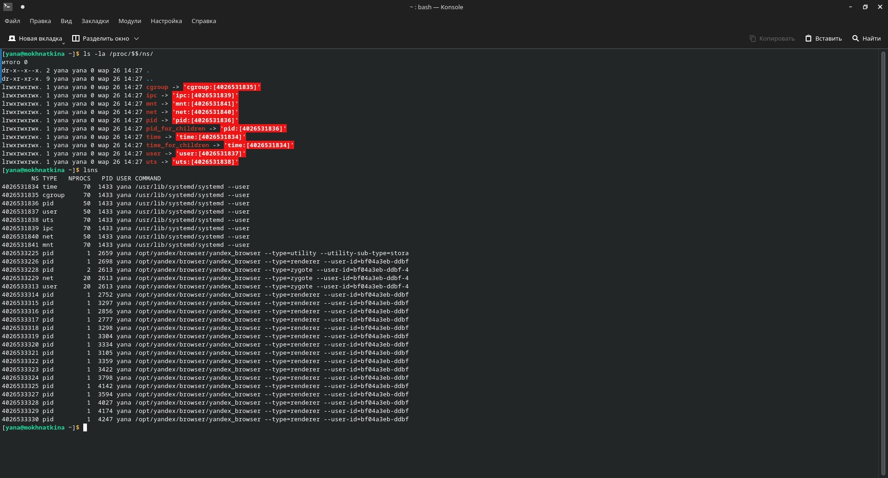
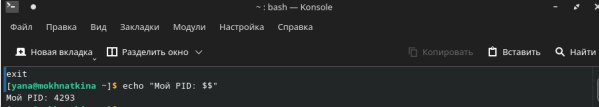
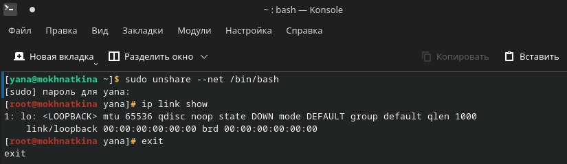
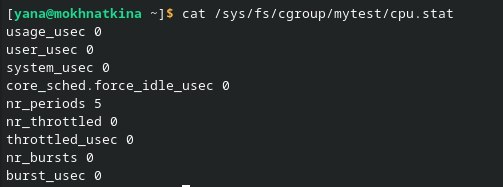
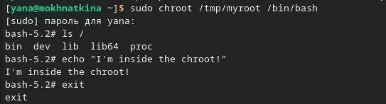

# Отчет: Namespaces, cgroups, chroot

## Namespaces (PID)

- `ls -la /proc/$$/ns/` — показывает namespace’ы, связанные с текущим процессом.
- `lsns` — выводит список namespace’ов разных типов по системе.

## Namespaces (PID namespace проверка)

- `echo "Мой PID: $$"` — показывает PID процесса внутри изолированного окружения (в PID namespace он может отличаться).
- `exit` — завершает работу в изолированной оболочке.

## Namespaces (NET)

- `sudo unshare --net /bin/bash` — запускает `bash` в новом network namespace.
- `ip link show` — показывает сетевые интерфейсы внутри нового NET namespace (обычно только `lo`).
- `exit` — выход из изолированного NET namespace.

## cgroups (CPU)

- `cat /sys/fs/cgroup/mytest/cpu.stat` — читает статистику CPU для cgroup `mytest` (проверка работы лимитов).

## chroot

- `sudo chroot /tmp/myroot /bin/bash` — запускает `bash` внутри нового корня `/tmp/myroot`.
- `ls /` — показывает содержимое нового корня внутри `chroot`.
- `echo "I'm inside the chroot!"` — подтверждает выполнение команд внутри `chroot`.
- `exit` — выход из `chroot`.

