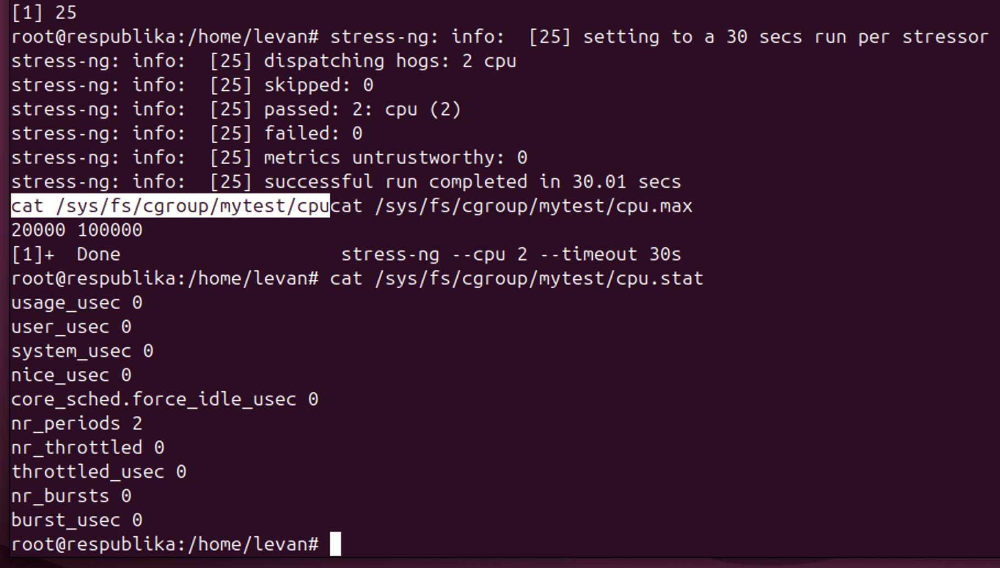
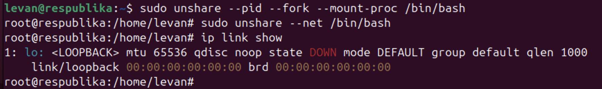
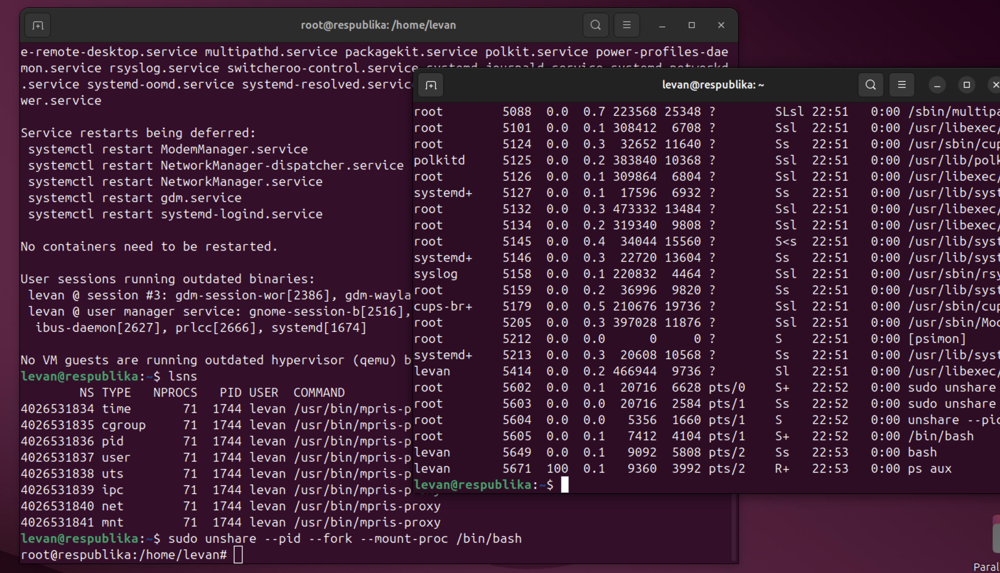
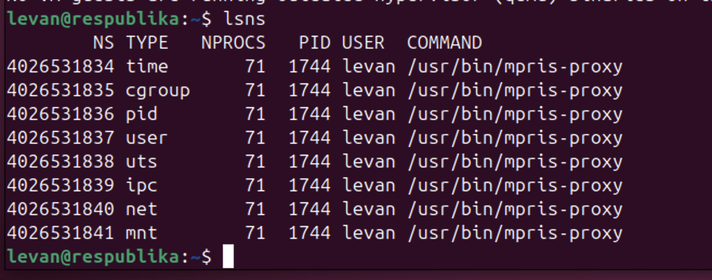
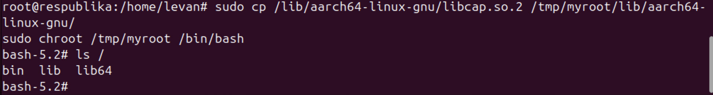

# Лабораторная работа 1

**Студент:** Вардания Леван Меджитович  
**Группа:** K0409-24-2

## Что было сделано

В работе были изучены механизмы `namespaces`, `cgroups` и `chroot` в Linux.

### 1. Просмотр namespace-ов

Команда:

```bash
lsns
```



 2. Создание нового PID namespace

Выполнены команды:

sudo unshare --pid --fork --mount-proc /bin/bash
echo $$
ps aux



3. Создание нового network namespace

Выполнены команды:

sudo unshare --net /bin/bash
ip link show



4. Ограничение CPU через cgroup

Выполнены команды:
sudo mkdir /sys/fs/cgroup/mytest
echo "20000 100000" | sudo tee /sys/fs/cgroup/mytest/cpu.max
cat /sys/fs/cgroup/mytest/cpu.max



5. Работа с chroot

Выполнены команды:
sudo chroot /tmp/myroot /bin/bash
ls /




Контрольные вопросы

1. Почему после exit процессы хоста остались нетронутыми?

Потому что процессы запускались в отдельных namespace, то есть в изолированном окружении. После выхода завершалась только текущая оболочка внутри этого пространства имён, а процессы основной системы не затрагивались.

2. Что произойдёт, если лимит памяти превысить?

Сработает механизм OOM-killer: ядро принудительно завершит процесс, который превысил допустимый лимит памяти, чтобы освободить ресурсы.

3. Чем namespace отличается от cgroup?

Namespace отвечает за изоляцию: процесс не видит другие процессы, сеть, точки монтирования и другие ресурсы хоста.

Cgroup отвечает за ограничения и учёт ресурсов: процессор, память, диск и другие системные ресурсы.