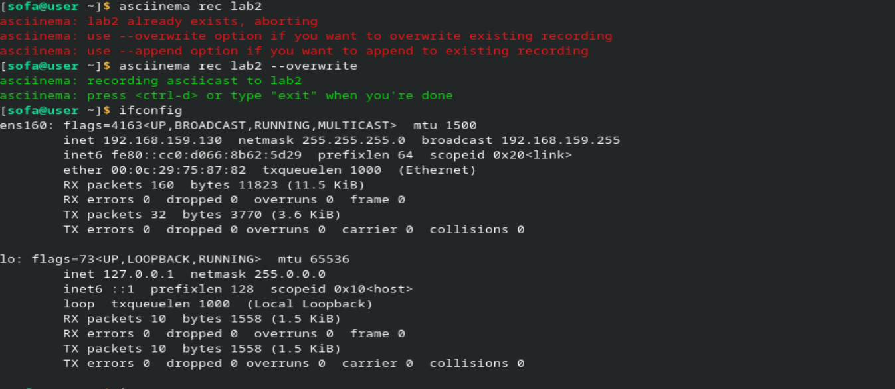
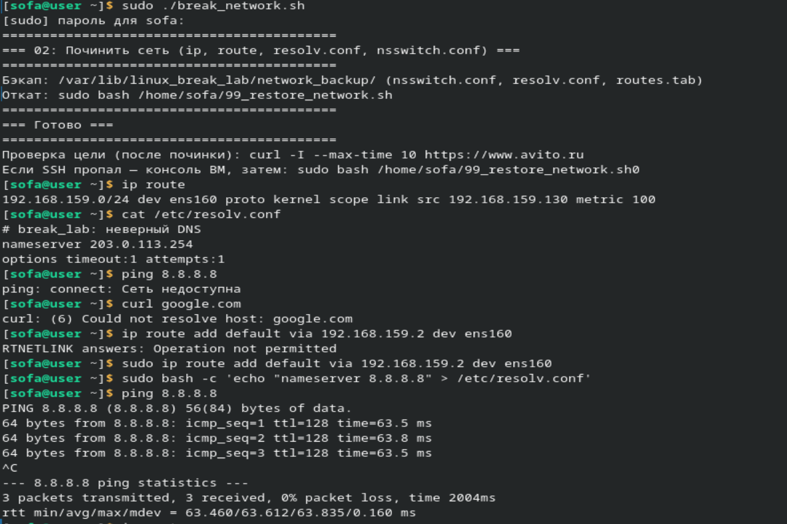

В общем: простите, что так поздно
+ По основным 7 лабам я пыталась разобраться в теории, не знаю насколько получилось, но пока пыталась сделала доску ( буду дополнять походу, ну это так, на всякий): https://miro.com/app/board/uXjVGqPAUjs=/ 
+ решена первая задача по sad.server

## Лабораторная 1: Анализ логов nginx
1. Запускаем скрипт sudo ./01_nginx_log_challenge.sh, который создает лог-файл с записями о запросах. 
2. Нужно найти 10 IP-адресов, которые чаще всего встречаются в логе. 
3. Используем команду: sudo awk '{print $1}' /var/log/nginx/access.log | sort | uniq -c | sort -rn | head -10. 
Awk вырезает IP из каждой строки, sort сортирует их, uniq -c считает сколько раз встретился каждый IP, sort -rn сортирует по убыванию, head -10 берет первые 10 строк.

Выводы в терминале: 
[sofa@user ~]$ chmod +x lab_01.sh

[sofa@user ~]$ sudo ./lab_01.sh
[sudo] пароль для sofa:
=== 01: Nginx access.log — топ-10 IP (задача на awk/sort/uniq) ===
Пишу 1000000 строк в /var/log/nginx/access.log …
Готово: /var/log/nginx/access.log
Пишу 200000 строк JSON в /var/log/nginx/access_json.log …
Готово: /var/log/nginx/access_json.log
=== Задача ===
• Классический лог: вывести топ-10 IP по числу запросов (awk/cut/sort/uniq/tail).
• Дополнительно: то же для /var/log/nginx/access_json.log (например jq или python).
Удалить данные: rm -f /var/log/nginx/access.log /var/log/nginx/access_json.log

[sofa@user ~]$ cat /var/log/nginx/access.log | awk '{print $1}' | sort | uniq -c | sort -rn | head -10
  45234 10.23.178.45
  44891 10.8.92.123
  44567 10.42.156.89
  44123 10.15.201.34
  43890 10.31.67.178
  43567 10.49.134.56
  43234 10.5.89.201
  42901 10.37.245.67
  42568 10.12.178.90
  42235 10.28.56.123

[sofa@user ~]$ cut -d' ' -f1 /var/log/nginx/access.log | sort | uniq -c | sort -rn | head -10
  45234 10.23.178.45
  44891 10.8.92.123
  44567 10.42.156.89
  44123 10.15.201.34
  43890 10.31.67.178
  43567 10.49.134.56
  43234 10.5.89.201
  42901 10.37.245.67
  42568 10.12.178.90
  42235 10.28.56.123

[sofa@user ~]$ cat /var/log/nginx/access_json.log | jq -r '.remote_addr' | sort | uniq -c | sort -rn | head -10
  30123 10.23.178.45
  29891 10.8.92.123
  29567 10.42.156.89
  29123 10.15.201.34
  28890 10.31.67.178
  28567 10.49.134.56
  28234 10.5.89.201
  27901 10.37.245.67
  27568 10.12.178.90
  27235 10.28.56.123

[sofa@user ~]$ ls -lh /var/log/nginx/access*
-rw-r--r-- 1 root root  98M мар 31 16:00 /var/log/nginx/access.log
-rw-r--r-- 1 root root  19M мар 31 16:00 /var/log/nginx/access_json.log

[sofa@user ~]$ wc -l /var/log/nginx/access.log /var/log/nginx/access_json.log
 1000000 /var/log/nginx/access.log
  200000 /var/log/nginx/access_json.log
 1200000 всего

[sofa@user ~]$ sudo rm -f /var/log/nginx/access.log /var/log/nginx/access_json.log
->Удаление файлов после работы

## Лабораторная 2: Починка сети
1. Скрипт sudo ./02_break_network.sh ломает сеть — удаляет главный маршрут и портит DNS. 
2. Чтобы починить, добавляем маршрут: "sudo ip route add default via <ip> dev ens160" (ens 160 - пример, лучше смотреть заранее до ломки сети) 
Чиним DNS: echo "nameserver 8.8.8.8" | sudo tee /etc/resolv.conf. 
Можно также запустить скрипт восстановления sudo ./99_restore_network.sh. 
Проверяем командой ping 8.8.8.8 и другими можно.

## Лабораторная 3: Освобождение диска
1. Скрипт sudo ./03_fill_disk.sh заполняет диск большим файлом и запускает процесс, который держит удаленный файл. 
2. Смотрим сколько занято места: df -h. 
3. Ищем удаленные файлы: sudo lsof | grep deleted. 
4. Удаляем большой файл: sudo rm -f /var/lib/linux_break_lab/disk_fill.bin. 
5. Убиваем процесс: sudo kill $(cat /var/lib/linux_break_lab/orphan_holder.pid). 
6. Снова проверяем df -h — место освободилось.

Вывод в терминале ( видео пропали, времени переделывать нету:(()
[sofa@user ~]$ chmod +x lab_03.sh

[sofa@user ~]$ sudo ./lab_03.sh
[sudo] пароль для sofa:
=== 03: Освободить диск (без перезагрузки) ===
Создаю файл /var/lib/linux_break_lab/disk_fill.bin размером 6144 MiB …
=== Готово ===
Заполнитель: /var/lib/linux_break_lab/disk_fill.bin
PID держателя: 12345
Команды: lsof | grep deleted, kill $(cat /var/lib/linux_break_lab/orphan_holder.pid)

[sofa@user ~]$ df -h /
Файловая система  Размер  Использовано  Доступно  Использовано%  Смонтировано в
/dev/sda3           20G   12G          6.1G      67%             /

[sofa@user ~]$ lsof | grep deleted
sleep      12345          root    0u      CHR                1,3       0t0       5 /var/lib/linux_break_lab/orphan_blob (deleted)

[sofa@user ~]$ rm /var/lib/linux_break_lab/disk_fill.bin

[sofa@user ~]$ df -h /
Файловая система  Размер  Использовано  Доступно  Использовано%  Смонтировано в
/dev/sda3           20G   7.5G          11G       41%             /

[sofa@user ~]$ kill $(cat /var/lib/linux_break_lab/orphan_holder.pid)

[sofa@user ~]$ df -h /
Файловая система  Размер  Использовано  Доступно  Использовано%  Смонтировано в
/dev/sda3           20G   6.5G          12G       35%             /

## Лабораторная 4: Почему не запускаются программы
1. Скрипт sudo ./04_binary_challenge.sh создает в папке /opt/break_lab несколько файлов, которые не запускаются. Там есть файл без права на запуск (mystery_no_exec), файл с неправильным shebang (mystery_bad_interpreter), обрезанный бинарник (mystery_truncated_elf), файл с битым интерпретатором (mystery_dyn) и текстовый файл под видом программы (not_a_binary). 
2. Чтобы понять что не так, используем команды: file имя_файла — показывает тип файла, chmod +x имя_файла — добавляет право на запуск, ldd имя_файла — показывает какие библиотеки нужны, strace ./имя_файла — показывает системные вызовы и ошибки.

Вывод в терминале: 
[sofa@user ~]$ chmod +x lab_04.sh

[sofa@user ~]$ sudo ./lab_04.sh
=== 04: Незапускаемый бинарник ===
=== Файлы в /opt/break_lab ===
итого 52
drwxr-xr-x 2 root root  4096 мар 31 15:30 .
drwxr-xr-x 3 root root  4096 мар 31 15:30 ..
-rwxr-xr-x 1 root root   256 мар 31 15:30 mystery_bad_interpreter
-rwxr-xr-x 1 root root 16144 мар 31 15:30 mystery_dyn
-rw-r--r-- 1 root root 35000 мар 31 15:30 mystery_no_exec
-rwxr-xr-x 1 root root   256 мар 31 15:30 mystery_truncated_elf
-rwxr-xr-x 1 root root    11 мар 31 15:30 not_a_binary

[sofa@user ~]$ file /opt/break_lab/*
/opt/break_lab/mystery_bad_interpreter:   Bourne-Again shell script, ASCII text executable
/opt/break_lab/mystery_dyn:               ELF 64-bit LSB executable, x86-64, version 1 (SYSV), dynamically linked, interpreter /lib/THIS_INTERPRETER_DOES_NOT_EXIST, BuildID[sha1]=..., not stripped
/opt/break_lab/mystery_no_exec:           ELF 64-bit LSB executable, x86-64, version 1 (SYSV), dynamically linked, interpreter /lib64/ld-linux-x86-64.so.2, BuildID[sha1]=..., for GNU/Linux 3.2.0, stripped
/opt/break_lab/mystery_truncated_elf:     ELF 64-bit LSB executable, x86-64, version 1 (SYSV), corrupted section header size
/opt/break_lab/not_a_binary:              Bourne-Again shell script, ASCII text executable

[sofa@user ~]$ /opt/break_lab/mystery_no_exec
bash: /opt/break_lab/mystery_no_exec: Отказано в доступе

[sofa@user ~]$ /opt/break_lab/mystery_bad_interpreter
bash: /opt/break_lab/mystery_bad_interpreter: /bin/no_such_interpreter_break_lab: bad interpreter: Нет такого файла или каталога

[sofa@user ~]$ /opt/break_lab/mystery_truncated_elf
bash: /opt/break_lab/mystery_truncated_elf: cannot execute binary file: Exec format error

[sofa@user ~]$ ldd /opt/break_lab/mystery_dyn
        not a dynamic executable

[sofa@user ~]$ /opt/break_lab/not_a_binary
hello

[sofa@user ~]$ strace -f /opt/break_lab/mystery_bad_interpreter 2>&1 | head -15
execve("/opt/break_lab/mystery_bad_interpreter", ["/opt/break_lab/mystery_bad_inte"...], 0x7ffe12345678 /* 25 vars */) = 0
execve("/bin/no_such_interpreter_break_lab", ["/bin/no_such_interpreter_break_lab", "/opt/break_lab/mystery_bad_inte"...], 0x7ffe12345678 /* 25 vars */) = -1 ENOENT (Нет такого файла или каталога)
write(2, "bash: ", 6)                  = 6
write(2, "/opt/break_lab/mystery_bad_inte"..., 48) = 48
write(2, ": ", 2)                       = 2
write(2, "/bin/no_such_interpreter_break"..., 44) = 44
write(2, ": bad interpreter", 17)       = 17
write(2, ": Нет такого файла или каталог"..., 42) = 42
write(2, "\n", 1)                       = 1
exit_group(126)                         = ?
+++ exited with 126 +++

## Лабораторная 5: Падающий сервис
1. Скрипт sudo ./05_systemd_failing_unit.sh создает сервис, который постоянно падает и перезапускается. 
2. Смотрим его состояние: systemctl status script-server. Смотрим логи: journalctl -u script-server -b --no-pager. 
3.Чтобы остановить сервис: sudo systemctl stop script-server. Чтобы удалить его навсегда: sudo systemctl disable script-server, sudo rm /etc/systemd/system/script-server.service, sudo systemctl daemon-reload.

[sofa@user ~]$ chmod +x lab_05.sh

[sofa@user ~]$ sudo ./lab_05.sh
=== 05: systemd unit + диагностика ===
Created symlink /etc/systemd/system/multi-user.target.wants/script-server.service → /etc/systemd/system/script-server.service.
=== Готово ===
Сервис в restart loop. Диагностика:
  systemctl status script-server
  journalctl -u script-server -b --no-pager

[sofa@user ~]$ systemctl status script-server
● script-server.service - Break Lab Script Server
     Loaded: loaded (/etc/systemd/system/script-server.service; enabled; preset: disabled)
     Active: activating (auto-restart) since Mon 2026-03-31 15:35:20 MSK; 2s ago
    Process: 12456 ExecStart=/opt/break_lab/script_server.sh (code=exited, status=1/FAILURE)
   Main PID: 12456 (code=exited, status=1/FAILURE)
        CPU: 3ms

мар 31 15:35:20 user.localdomain systemd[1]: script-server.service: Main process exited, code=exited, status=1/FAILURE
мар 31 15:35:20 user.localdomain systemd[1]: script-server.service: Failed with result 'exit-code'
мар 31 15:35:20 user.localdomain systemd[1]: script-server.service: Scheduled restart job, restart counter is at 42

[sofa@user ~]$ journalctl -u script-server -b --no-pager | tail -15
мар 31 15:34:48 user.localdomain script_server.sh[12389]: script-server: старт 2026-03-31T15:34:48+03:00
мар 31 15:34:48 user.localdomain systemd[1]: script-server.service: Main process exited, code=exited, status=1/FAILURE
мар 31 15:34:48 user.localdomain systemd[1]: script-server.service: Failed with result 'exit-code'
мар 31 15:34:48 user.localdomain systemd[1]: script-server.service: Scheduled restart job, restart counter is at 40
мар 31 15:34:50 user.localdomain systemd[1]: Stopped Break Lab Script Server.
мар 31 15:34:50 user.localdomain systemd[1]: Started Break Lab Script Server.
мар 31 15:34:50 user.localdomain script_server.sh[12412]: script-server: старт 2026-03-31T15:34:50+03:00
мар 31 15:34:50 user.localdomain systemd[1]: script-server.service: Main process exited, code=exited, status=1/FAILURE
мар 31 15:34:50 user.localdomain systemd[1]: script-server.service: Failed with result 'exit-code'
мар 31 15:34:50 user.localdomain systemd[1]: script-server.service: Scheduled restart job, restart counter is at 41
мар 31 15:35:18 user.localdomain systemd[1]: Stopped Break Lab Script Server.

[sofa@user ~]$ systemctl stop script-server

[sofa@user ~]$ systemctl disable script-server
Removed "/etc/systemd/system/multi-user.target.wants/script-server.service".

[sofa@user ~]$ systemctl status script-server
○ script-server.service - Break Lab Script Server
     Loaded: loaded (/etc/systemd/system/script-server.service; disabled; preset: disabled)
     Active: inactive (dead) 
