# Практическая работа PRACTIC (задания 1–5)

## Цель работы

Изучить работу многоуровневого Docker-стенда, настроить и проверить Nginx как reverse proxy, проанализировать контейнеры и образы, протестировать rate limiting, изучить логирование и выполнить базовую сетевую и security-диагностику.

## Подготовка проекта

Сначала был клонирован репозиторий и открыт каталог `PRACTIC`. После этого стенд был собран и запущен в фоне.

```bash
git clone https://github.com/Dubrovsky18/SiriusK8s.git
docker-compose up --build -d
docker-compose ps
```

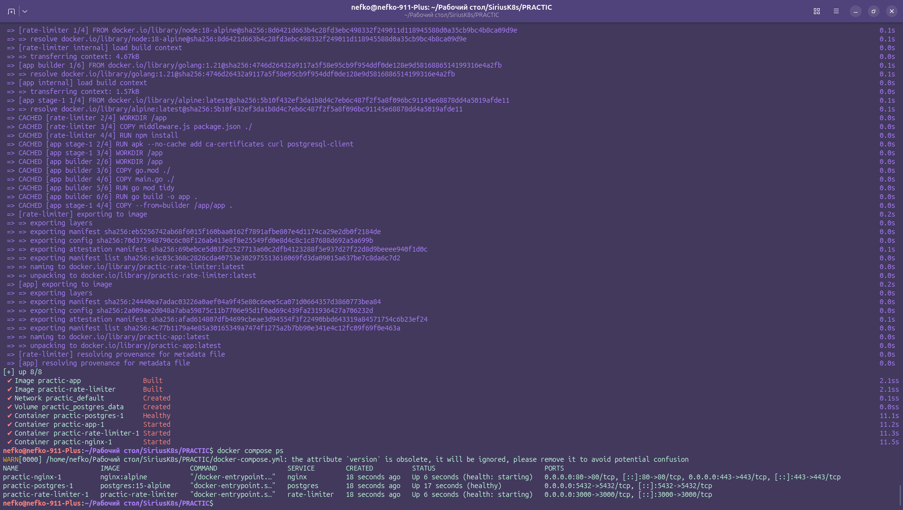

Тут была ошибка на ошибке в докерфайле, го моде и тд, чат гптшечка мне их исправил, как кидал Арсений

После запуска были проверены основные HTTP-эндпоинты приложения.

```bash
curl -v http://localhost/health
curl -v http://localhost/api/status
```

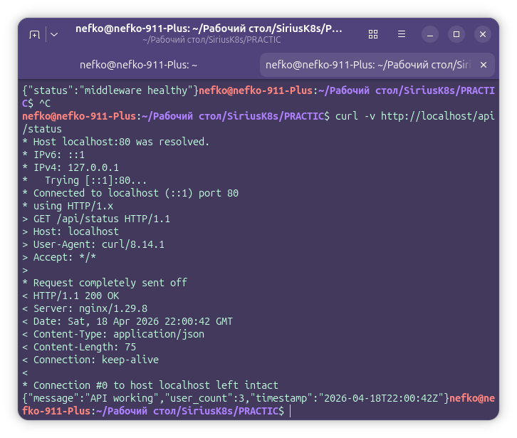

**Результат:** контейнеры успешно запустились, эндпоинты `/health` и `/api/status` вернули корректный ответ.

---

## Задание 1. Проверка Nginx

На первом этапе была исследована работа Nginx в роли reverse proxy. Для этого были просмотрены логи, проверена конфигурация и выполнена её перезагрузка без полной остановки контейнера.

```bash
docker-compose logs --tail 30 nginx
docker-compose exec nginx nginx -t
docker-compose exec nginx nginx -s reload
docker-compose exec nginx ss -tlnp
```

В nginx:alpine утилиты ss просто нет, поэтому сначала не работала последняя команда. Чтобы это исправить, временно установил утилиту командой:

```bash
docker compose exec nginx sh -lc 'apk add --no-cache iproute2 && ss -tlnp'
```

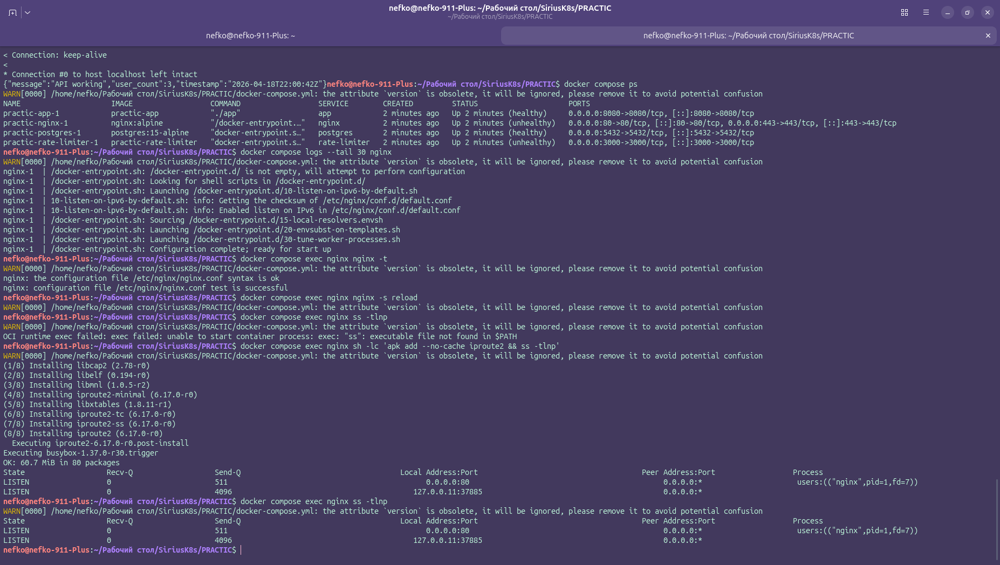

**Результат:** конфигурация Nginx корректна, сервис принимает подключения и проксирует запросы внутри стенда.

---

## Задание 2. Анализ Docker-образов и контейнера приложения

На втором этапе был выполнен базовый анализ Docker-образов и файловой структуры контейнера приложения.

```bash
docker images
docker-compose exec app ls -lah /app
```

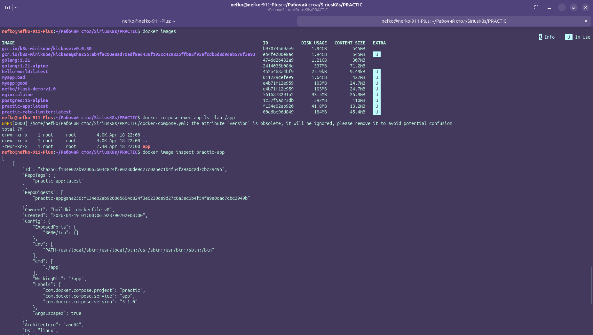

Дополнительно был выбран образ приложения и просмотрены его метаданные и история слоёв.

```bash
docker image inspect practic-app
docker history practic-app
```

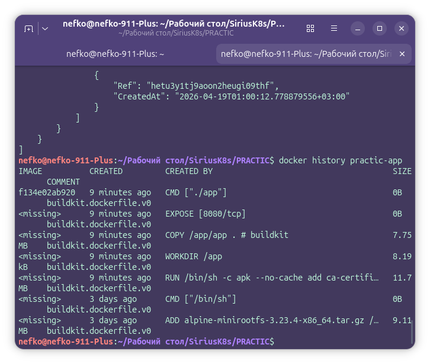

**Результат:** подтверждено, что проект использует контейнеризацию приложения и middleware, а также содержит подготовленную структуру для запуска внутри Docker.

---

## Задание 3. Проверка rate limiting

На третьем этапе было протестировано ограничение количества запросов и просмотрены логи middleware.

```bash
bash test-rate-limiting.sh
docker-compose logs --tail 50 rate-limiter
docker-compose exec rate-limiter sh -lc 'ls -lah /app/logs'
docker-compose exec rate-limiter sh -lc 'tail -n 20 /app/logs/requests-*.log'
docker-compose exec postgres psql -U postgres -d demo -c "SELECT * FROM request_logs ORDER BY timestamp DESC LIMIT 10;"
```

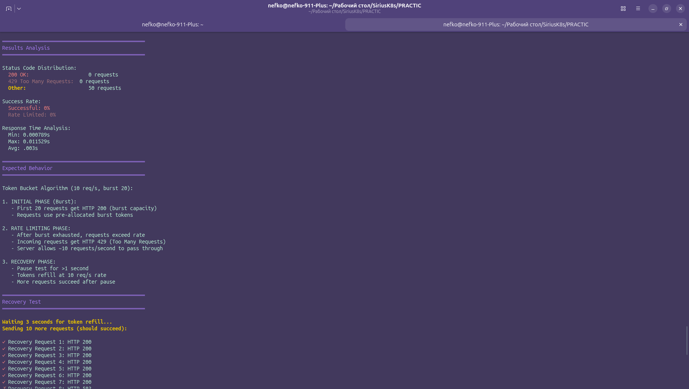
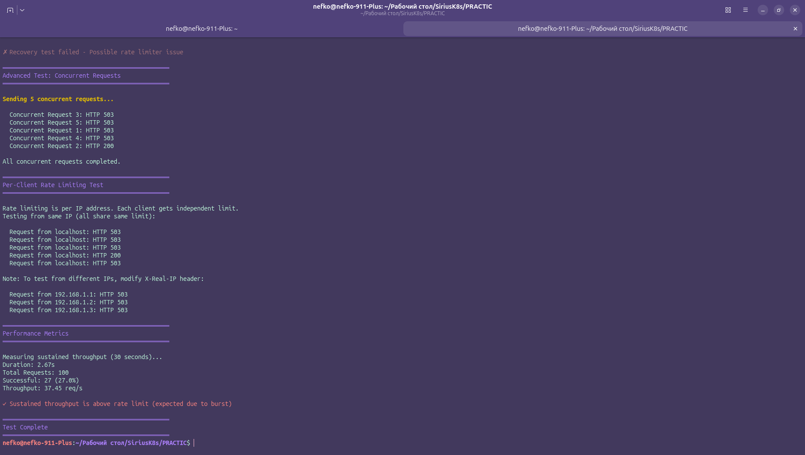
!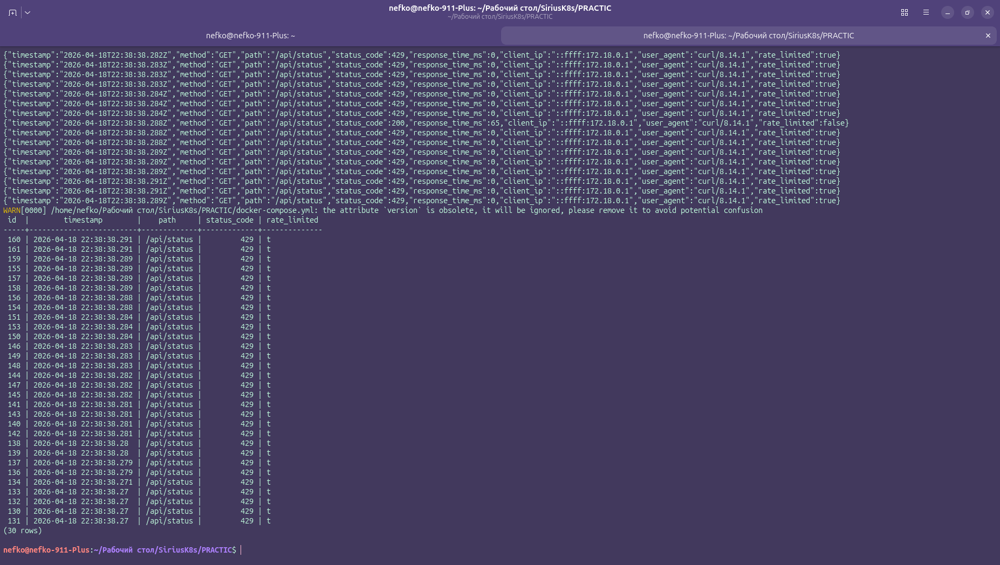

**Результат:** при серии быстрых запросов часть обращений начала получать код `429 Too Many Requests`, что подтверждает корректную работу ограничения запросов.

---

## Задание 4. Логирование и наблюдаемость

На четвёртом этапе было изучено двойное логирование: в файл и в базу данных PostgreSQL.

```bash
docker-compose exec rate-limiter sh -lc 'cat /app/logs/requests-*.log | head -20'
docker-compose exec postgres psql -U postgres -d demo -c "SELECT timestamp, method, path, status_code, response_time_ms, rate_limited FROM request_logs WHERE status_code = 429 ORDER BY timestamp DESC;"
docker-compose exec postgres psql -U postgres -d demo -c "SELECT status_code, COUNT(*) AS count, AVG(response_time_ms) AS avg_response_ms, MAX(response_time_ms) AS max_response_ms FROM request_logs GROUP BY status_code ORDER BY count DESC;"
```

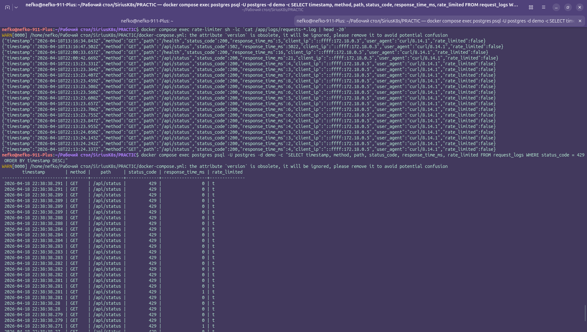
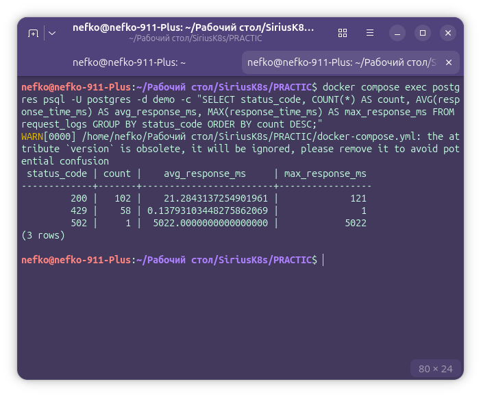

**Результат:** подтверждено, что middleware сохраняет информацию о запросах как в файловые логи, так и в таблицу базы данных, что позволяет анализировать поведение сервиса и производительность.

---

## Задание 5. Сетевая отладка и security-проверка

На пятом этапе была выполнена базовая отладка HTTP-взаимодействия и security-проверка контейнера приложения.

Сначала был запущен расширенный API-тест и подготовлены инструменты отладки.

```bash
bash test-api.sh
bash setup-debugging.sh
```

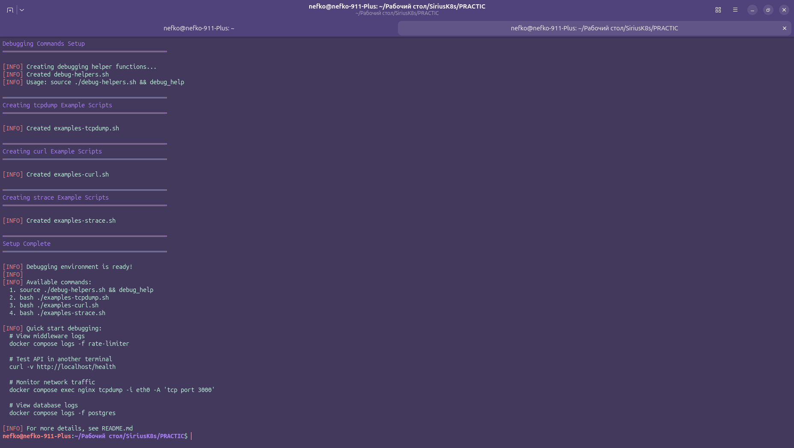

Далее был запущен security-скрипт для контейнера приложения.

```bash
chmod +x check-docker-security.sh
./check-docker-security.sh app
```

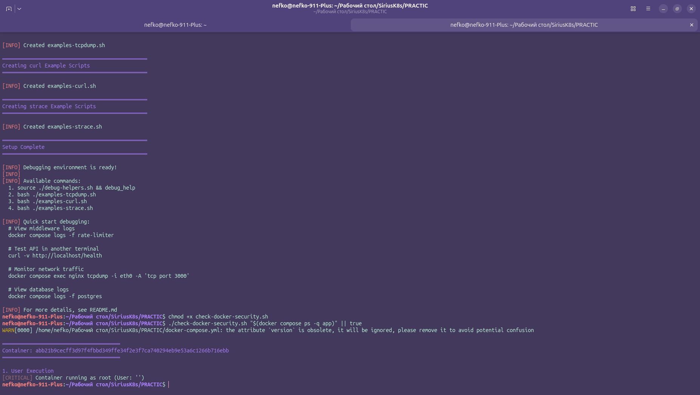

Для анализа сетевого трафика был использован `tcpdump`.

```bash
docker-compose exec nginx tcpdump -i eth0 -A 'tcp port 3000'
```

В другом терминале был выполнен запрос:

```bash
curl -v http://localhost/api/status
```

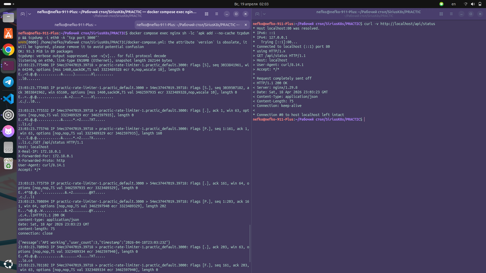

**Результат:** трафик между сервисами проходит корректно, security-скрипт показывает текущие риски контейнера и рекомендации по усилению безопасности.

---

## Завершение работы

После завершения практической работы стенд был остановлен.

```bash
docker-compose down
```

## Вывод

В ходе практической работы был изучен Docker-стенд из нескольких сервисов. Были проверены запуск и работа контейнеров, исследована конфигурация Nginx, протестирован механизм rate limiting, изучено логирование в файл и базу данных, а также выполнены базовые действия по сетевой диагностике и security-анализу контейнера. Практика показала, как устроен типовой стек сервисов и как можно диагностировать его состояние с помощью стандартных инструментов.