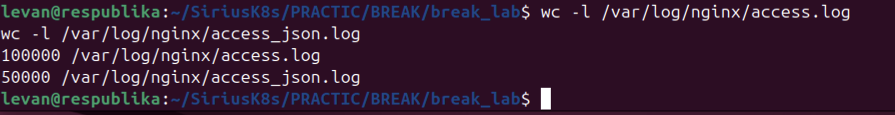

# 01_nginx_log_challenge

**Студент:** Вардания Леван Меджитович  
**Группа:** K0409-24-2

## Цель работы

Сгенерировать nginx access log и JSON log, а затем определить топ-10 IP-адресов по числу запросов.

## Ход работы

Сначала был использован скрипт `01_nginx_log_challenge.sh`, который создаёт два файла:

- `/var/log/nginx/access.log`
- `/var/log/nginx/access_json.log`

Во время выполнения было выявлено, что в скрипте для обычного `access.log` используется переменная `LINES`, которая конфликтует со встроенной переменной bash и поэтому вместо большого объёма логов создавалось только 24 строки. После этого обычный `access.log` был сгенерирован вручную в том же формате, а JSON-лог был успешно создан скриптом.

Проверка количества строк:



## Топ-10 IP для обычного access.log

Для обычного access log использовалась команда:

```bash
awk '{print $1}' /var/log/nginx/access.log | sort | uniq -c | sort -nr | head -10
```

Топ-10 IP для JSON-лога

Для JSON-лога использовался Python:

python3 - <<'PY'
import json
from collections import Counter

c = Counter()
with open('/var/log/nginx/access_json.log', 'r') as f:
    for line in f:
        obj = json.loads(line)
        c[obj['remote_addr']] += 1

for ip, n in c.most_common(10):
    print(f"{n:7d} {ip}")
PY

Вывод

В ходе работы были подготовлены два вида nginx-логов: обычный и JSON.
Для обоих логов был найден топ-10 IP-адресов по количеству запросов.
Для обычного лога использовались стандартные Linux-утилиты, а для JSON-лога — Python и модуль json.