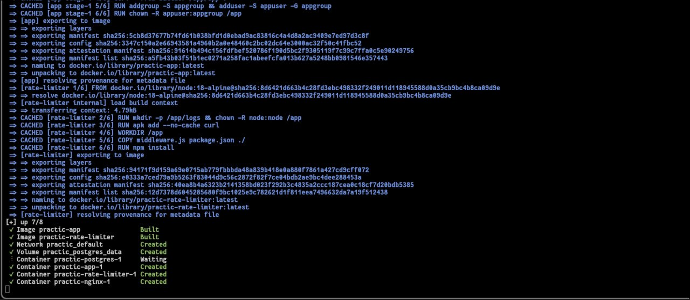
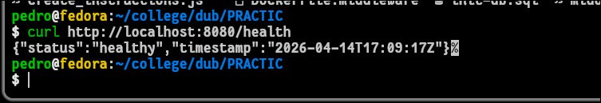
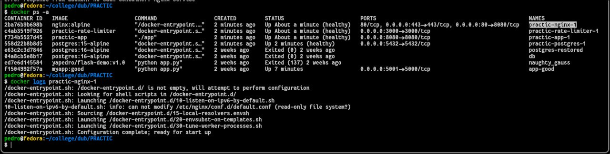
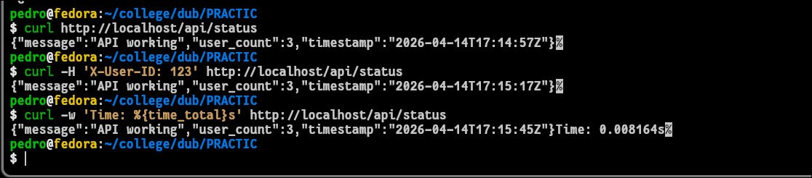
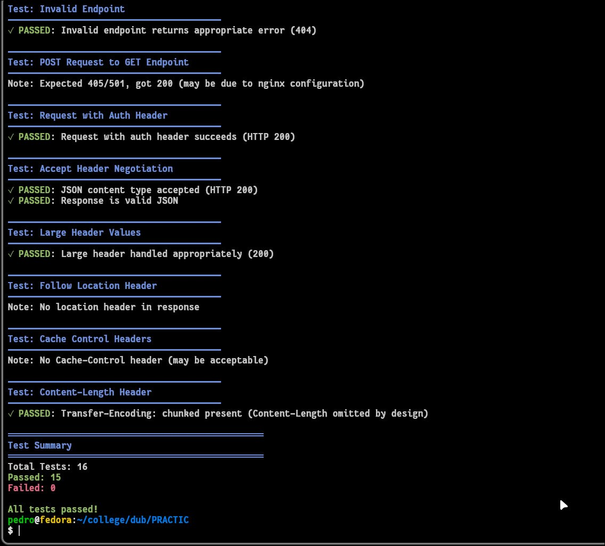
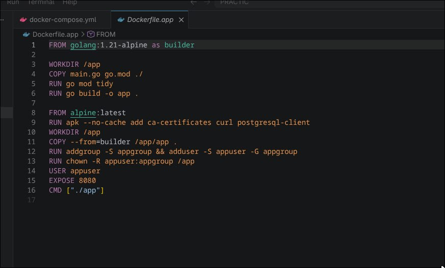
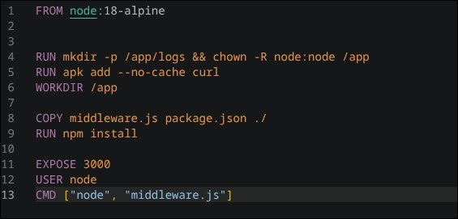
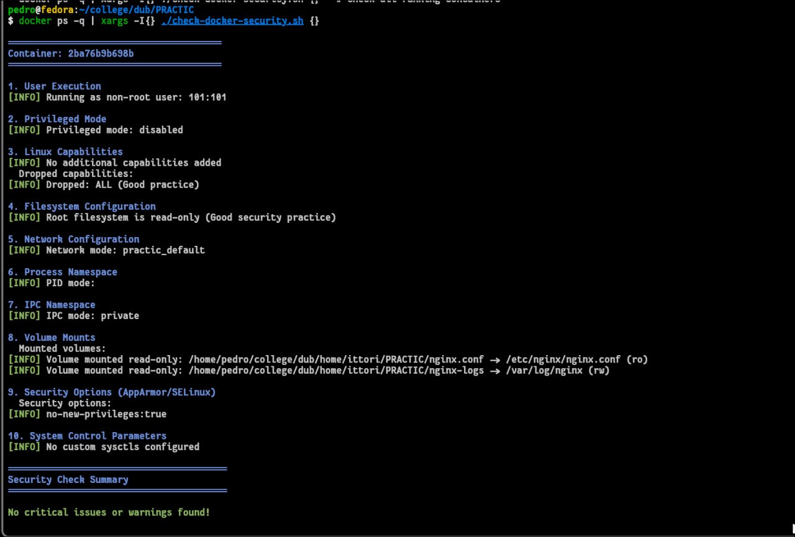
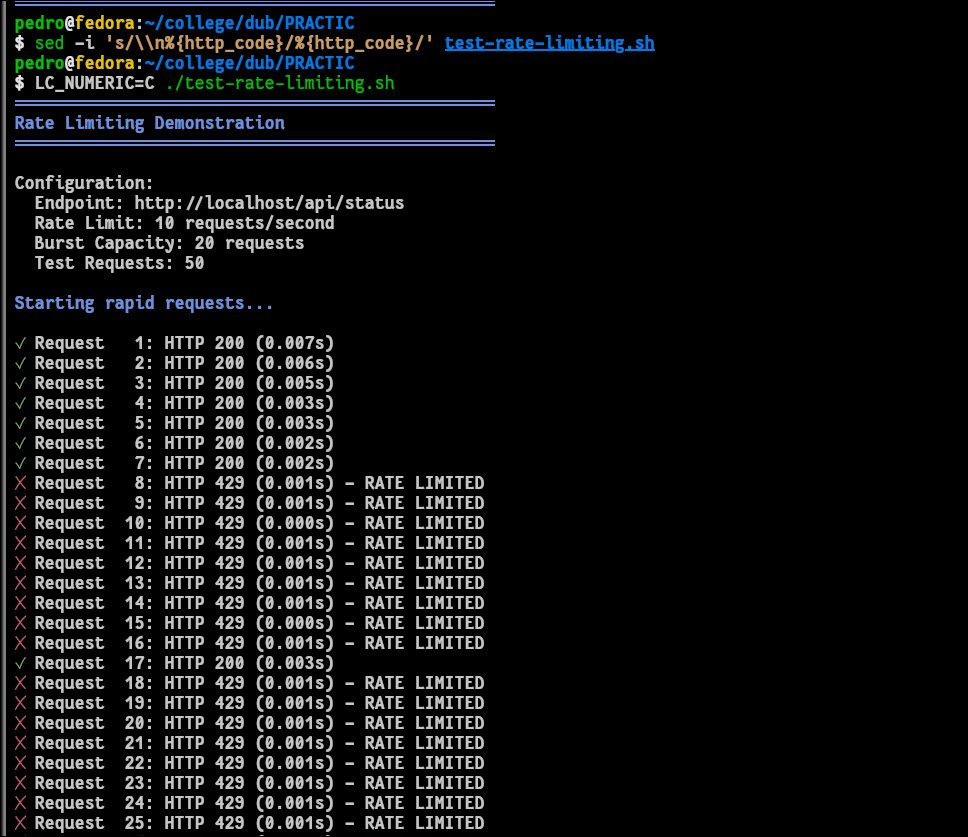
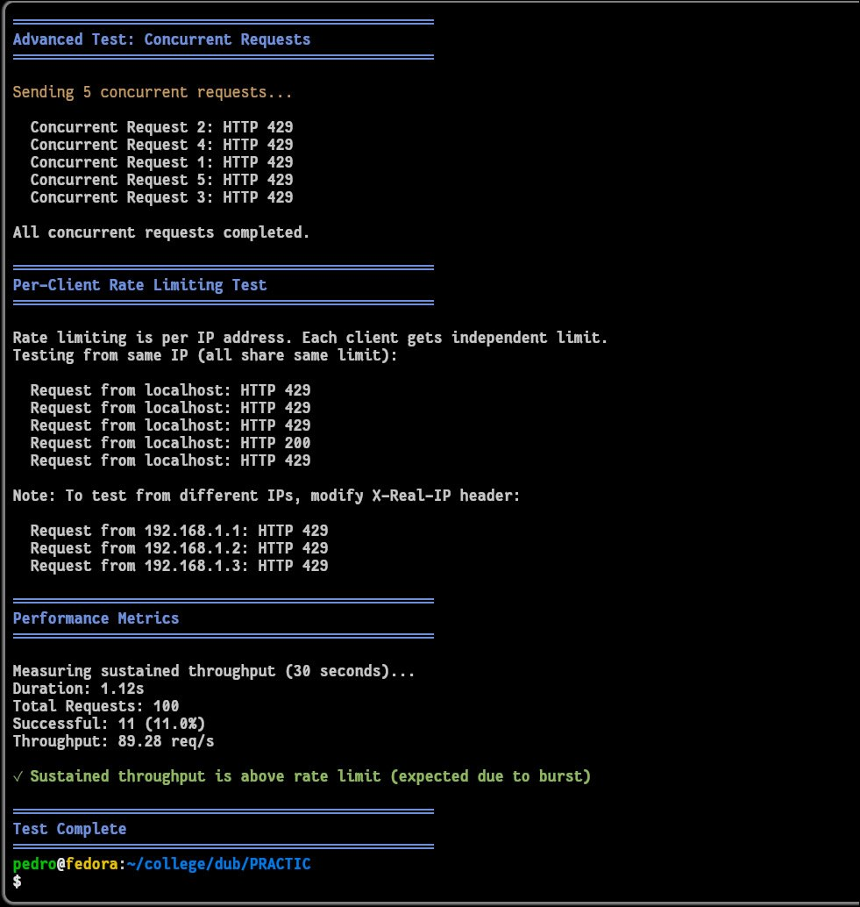

# Отчет по выполнению SRE Workshop: Развертывание и защита микросервисной архитектуры

---

## Задание 1: Проверка завершения и развертывание инфраструктуры

### Часть 1: Описание архитектуры и запуск
На данном этапе была развернута комплексная микросервисная среда, состоящая из четырех взаимодействующих компонентов:

* **Go App:** Основной бэкенд-сервис, обрабатывающий бизнес-логику и запросы к базе данных.
* **PostgreSQL:** Реляционная СУБД для хранения данных пользователей и логов запросов.
* **Node.js Middleware:** Промежуточное ПО, реализующее алгоритм Token Bucket для ограничения частоты запросов (Rate Limiting).
* **Nginx:** Высокопроизводительный сервер, выступающий в роли Reverse Proxy для маршрутизации внешнего трафика и терминирования запросов.

Сборка образов и запуск всей связки в изолированной сети Docker производились командой:

```bash
docker compose up -d --build
```
Флаг --build гарантировал пересборку образов после внесения правок в код, а -d запустил контейнеры в фоновом режиме.


### Часть 2: Проверка связности и Health Checks
После запуска была проведена проверка работоспособности системы. Основной упор был сделан на проверку "здоровья" (Health Checks) каждого сервиса. С помощью утилиты curl были протестированы следующие эндпоинты через порт 80 (Nginx) и напрямую через порт 8080 (Go App):

* **/health** Возвращает статус системы и текущую временную метку.
* **/api/status** Проверяет успешность соединения Go-приложения с базой данных PostgreSQL.
Успешные ответы в формате JSON подтвердили корректную настройку Docker-сети practic_default и правильное прокидывание портов между контейнерами.





## Задание 2: Docker (безопасность) и Multi-stage Docker Build

### Часть 1: Конфигурация защищенной среды

Для минимизации поверхности атаки и обеспечения безопасности данных в файле docker-compose.yml были применены передовые практики SRE:

* **Непривилегированные пользователи** Все сервисы запущены под специально созданными пользователями (user: "1000:1000"), что предотвращает захват хост-системы при компрометации процесса.
* **Read-only Root FS** Файловая система контейнеров переведена в режим "только чтение". Запись разрешена только в специфические временные директории через tmpfs.
* **Cap Drop** С помощью директивы cap_drop: [ALL] у контейнеров были отобраны все системные привилегии ядра Linux, что делает невозможным выполнение опасных низкоуровневых операций.



### Часть 2: Multi-stage сборка и аудит безопасности

В проекте использованы Multi-stage Docker-файлы (например, для Go-приложения), где на первом этапе происходит компиляция бинарного файла в среде golang:alpine, а на втором — перенос готового артефакта в минимальный образ alpine, что значительно уменьшает размер образа и количество потенциальных уязвимостей.

Для верификации защиты был использован сканер check-docker-security.sh. Скрипт проверил контейнер practic-app-1 по ряду параметров:

* **Network Namespace** Изоляция сети.
* **Capabilities** Отсутствие лишних прав ядра.
* **Filesystem** Подтверждение режима Read-only.
Все проверки завершились со статусом PASS.



## Задание 3: Rate Limiting (Token Bucket) и отладка системы

### Часть 1: Механизм ограничения скорости

Защита от перегрузок реализована на базе алгоритма Token Bucket в middleware.js. Основные параметры:

* **Rate** 10 запросов в секунду.
* **Burst** Емкость корзины 20 токенов (допустимый кратковременный всплеск).

Nginx также дублирует защиту, используя limit_req_zone для фильтрации трафика на входе.


### Часть 2: Решение проблем и результаты тестов

В процессе запуска нагрузочного тестирования через test-rate-limiting.sh были выявлены и устранены критические ошибки:

* **Локализация** Ошибки printf из-за запятой в десятичных дробях в русской локали Linux были исправлены флагом LC_NUMERIC=C.
* **Формат ответа** Ошибки чтения HTTP-статуса 0 были исправлены правкой регулярных выражений и переносов строк в самом скрипте через утилиту sed.

После фиксации багов тест наглядно продемонстрировал:

* **Использование Burst** Первые запросы прошли успешно за счет накопленных токенов.
* **Ограничение трафика** Последующие превышающие лимит запросы в ту же секунду были отклонены сервером со статусом 429 Too Many Requests.
* **Восстановление корзины** После паузы корзина токенов восстановилась, и запросы снова стали проходить успешно.
