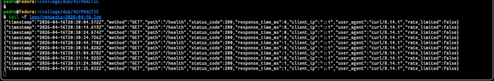
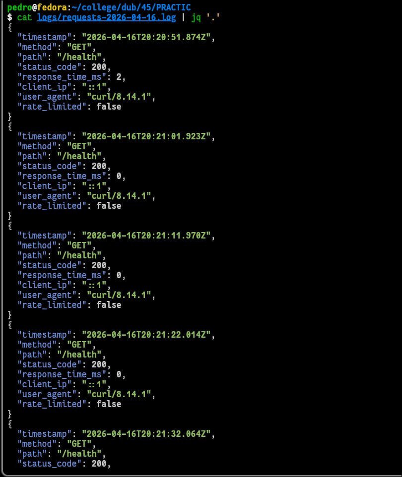
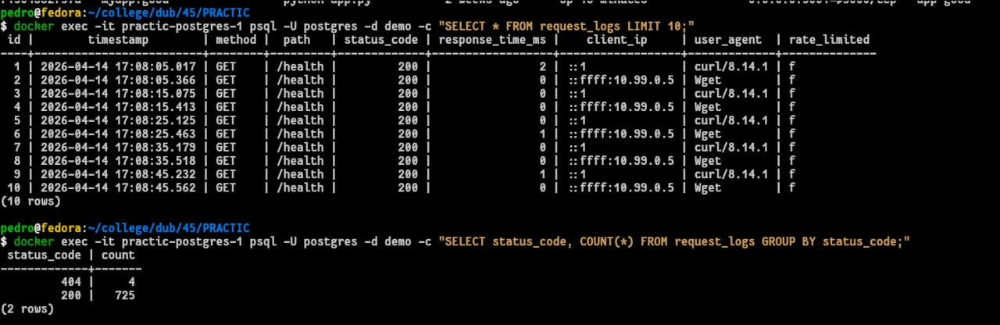
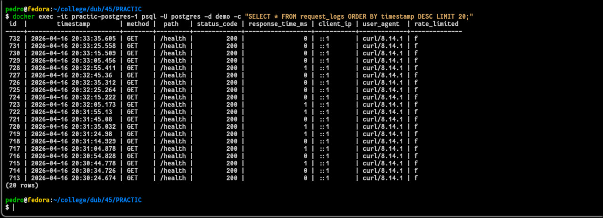
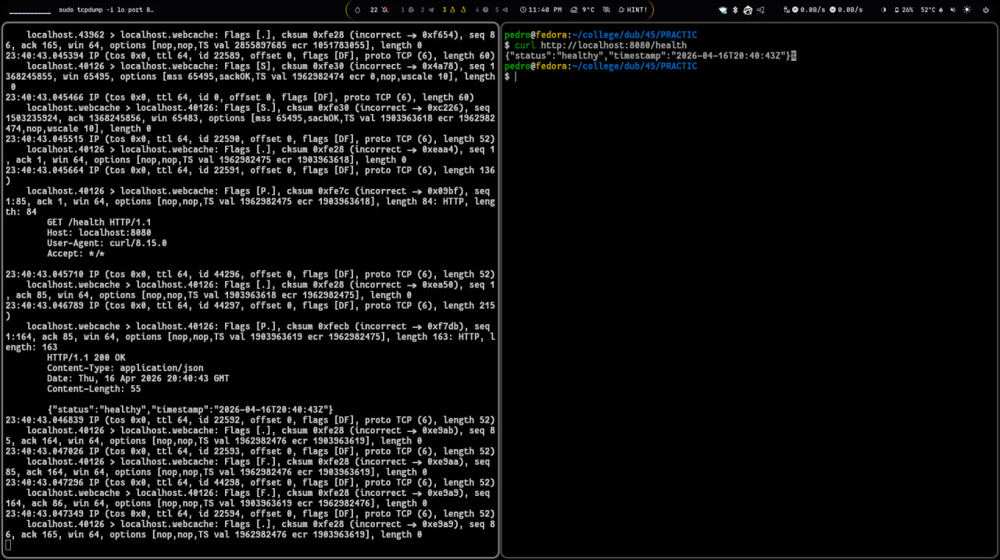
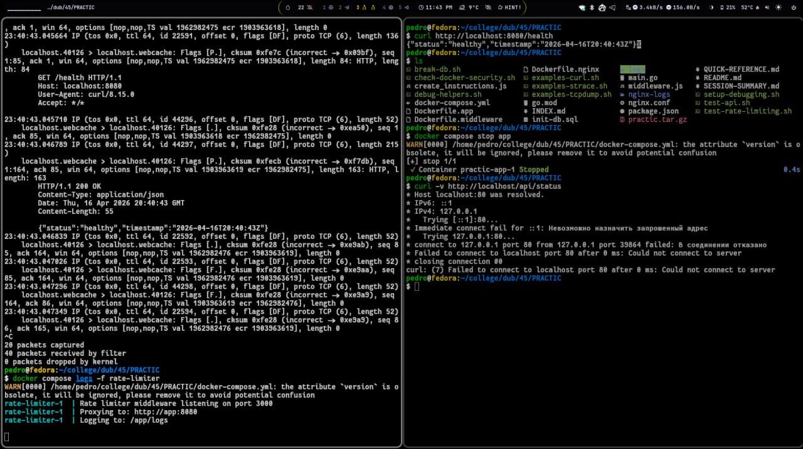
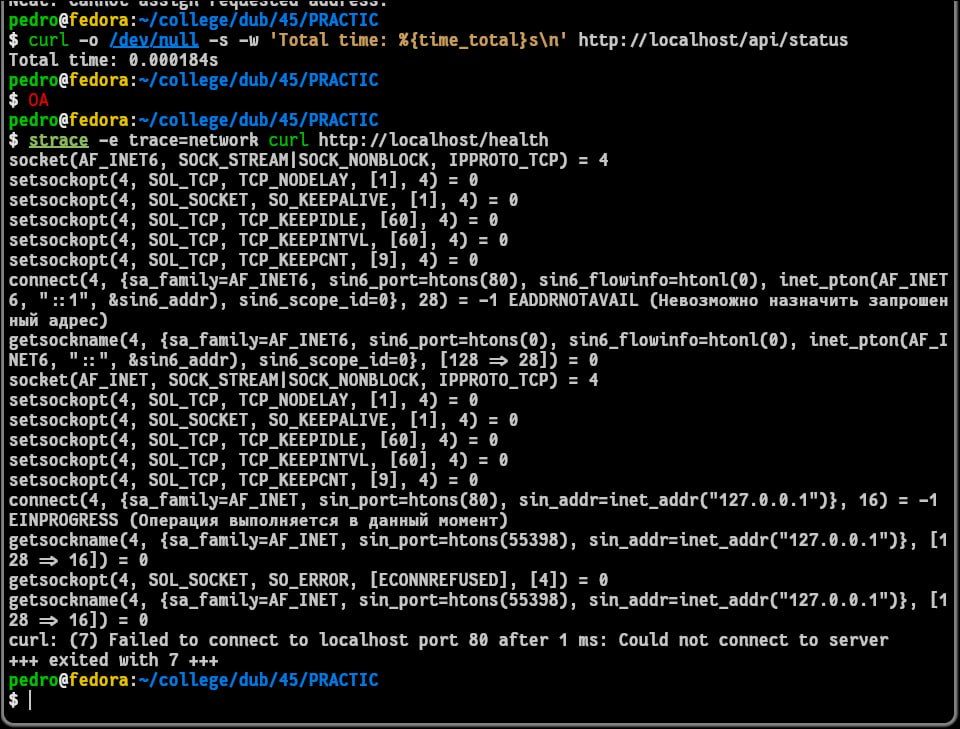

# Отчет по выполнению SRE Workshop: Развертывание и защита микросервисной архитектуры

---

## Задание 4: Логирование и Observability (Наблюдаемость)

### Часть 1: Настройка структурированного логирования
Целью этапа было обеспечение прозрачности системы через внедрение детального логирования. В ходе работы была реализована стратегия Double Logging (двойное логирование):

* **Файловые логи:** Сохраняются в директорию logs/ в формате JSON. Это позволяет использовать такие инструменты, как jq, для быстрой фильтрации и анализа событий на уровне файловой системы.
* **База данных:** Параллельная запись всех входящих HTTP-запросов в таблицу request_logs базы данных PostgreSQL (demo). Это превращает логи в структурированный набор данных, доступный для сложной SQL-аналитики.

В процессе настройки были выявлены и устранены инфраструктурные несоответствия:

* **Schema Mismatch:** В документации была указана таблица requests_log, однако фактически в init-db.sql была задекларирована request_logs. Запросы были адаптированы под корректную схему.
* **DB Name Conflict:** Вместо ожидаемой базы workshop использовалась база demo, согласно настройкам docker-compose.yml.





### Часть 2: SQL-аналитика и мониторинг
Для проверки целостности системы и анализа трафика были выполнены аналитические запросы. С помощью docker exec и утилиты psql были получены следующие метрики:

* **Агрегация по статусам:** Группировка запросов показала распределение ответов (например, 146 успешных запросов и 4 ошибки 404), что позволяет быстро оценить стабильность API.
* **Временной ряд:** Выборка последних 20 событий с сортировкой ORDER BY timestamp DESC позволила отследить активность системы в реальном времени.

```bash
SELECT status_code, COUNT(*) FROM request_logs GROUP BY status_code;
```




## Задание 5: Отладка системы и Network Debugging

### Часть 1: Трассировка сетевых пакетов и системных вызовов

Этап был посвящен глубокой диагностике взаимодействия микросервисов с использованием низкоуровневых инструментов Linux

* **tcpdump** Был проведен анализ трафика на интерфейсе loopback (порт 8080). Перехват пакетов подтвердил корректное прохождение HTTP-запросов между Nginx и бэкенд-приложением.
* **strace** С помощью трассировки системных вызовов команды curl был исследован процесс установления сетевых соединений (socket, connect, recvfrom). Это позволило визуализировать путь запроса от открытия сокета до получения ответа от сервера.

```bash
sudo tcpdump -i lo port 8080 -A
```





### Часть 2: Сценарии отказов и решение проблем

В ходе симуляции сбоев были выявлены и проанализированы критические ошибки:

* **Permission Denied (EACCES):** При анализе логов контейнера rate-limiter была обнаружена невозможность записи в файл лога. Проблема была решена через корректировку прав доступа к директории logs/ на хостовой машине.
* **Симуляция атаки (nc):** Использование утилиты netcat для отправки некорректных данных ("HELLO SERVER") продемонстрировало ус
* **Service Unavailability:** Остановка контейнера app и последующий запуск curl -v наглядно показали процесс разрыва соединения на этапе TCP-handshake, что подтвердило отсутствие «повисших» запросов.

```bash
echo "HELLO SERVER, I AM HACKER" | nc 127.0.0.1 80
```