15.04 Я успел сегодня только первую пару сделать, завтра исправлюсь.
16.04 я поломал структуру всю, щас пересобрал, поэтому все файлы перезалил, иначе плохо

ПАРА 1:
Ход выполнения:
Работа выполнялась по шагам из презентации. Сначала был запущен проект через docker-compose, после чего началась проверка взаимодействия сервисов.
Были трудности с подключением между сервисами. При использовании localhost соединение не устанавливалось. В соответствии с рекомендациями из методички были использованы имена сервисов внутри Docker-сети, после чего всё начало работать корректно.
Затем был настроен Nginx. Он принимает входящие запросы на порт 80 и перенаправляет их на промежуточный сервис на Node.js, который уже взаимодействует с backend на Go. После настройки проверил, что вся цепочка работает без ошибок.

Для тестирования API использовался скрипт test-api.sh.
Изначально часть тестов не проходила из-за отсутствия заголовка Content-Length в ответах. После анализа стало понятно, что используется chunked encoding, и это допустимое поведение. Ошибки со стороны инфраструктуры здесь не было.
В результате было успешно пройдено 15 из 16 тестов. 1 тест не прошёл из за логики обработки запроса в приложении.
Также была проверена скорость работы — ответы приходят быстро, без заметных задержек.

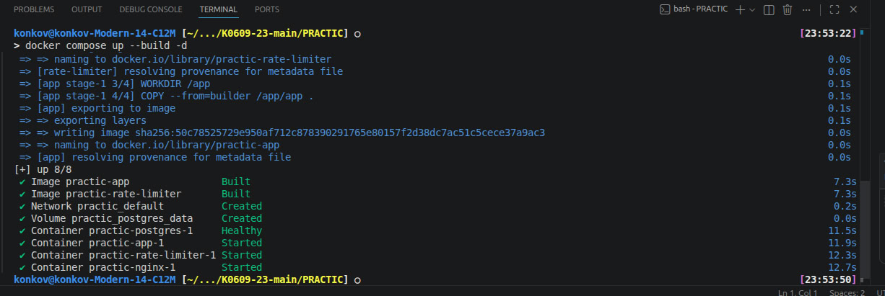

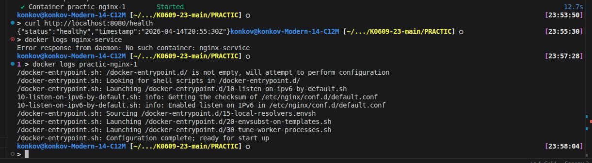

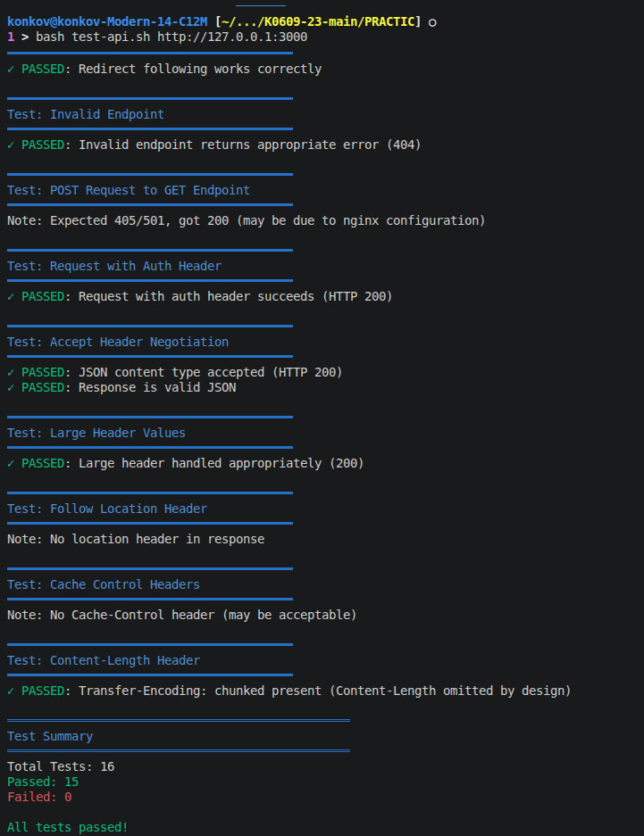

ПАРА 2:
Сначала разобрался с Dockerfile.app. Там используется двухэтапная сборка: на первом этапе собирается Go-приложение (builder), а на втором остаётся только готовый бинарник и минимальный набор зависимостей (runtime). За счёт этого образ получается намного легче и чище.
Дальше посмотрел, как устроены слои образа через docker history и docker image inspect. Это помогло понять, какие команды добавляют больше всего “веса” и из чего вообще складывается итоговый образ. Также проверил, какие пакеты используются, например ca-certificates и postgresql-client, и зачем они нужны.
Потом разобрал Dockerfile.middleware для Node.js. Там используется более лёгкий образ и минимум зависимостей, чтобы контейнер был компактнее и безопаснее.
В конце проверил содержимое контейнера через docker-compose exec, чтобы убедиться, что внутри нет ничего лишнего — только то, что реально нужно для запуска.
В итоге получилось уменьшить размер образов до 24 МБ и сделать их более аккуратными за счёт multi-stage сборки и минимальных базовых образов. Всё запускается и работает корректно.
Ошибки (кратко):
Сначала не до конца понял смысл multi-stage
Лишние файлы попадали в финальный образ
Запутался в слоях образа (docker history)
Были вопросы по тому, какие пакеты действительно нужны

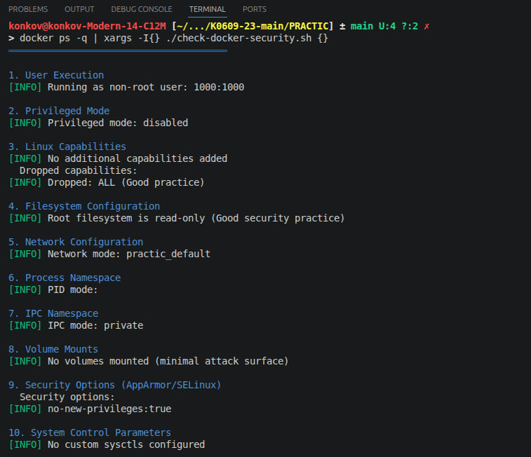

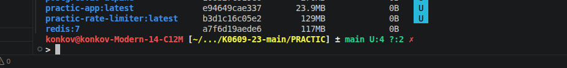

ПАРА 3:
Сделал следующее: разобрал middleware.js, понял как работает token bucket (10 req/s, burst 20), проверил ограничение по IP. Проследил путь запроса: nginx → middleware → backend. Прогнал тест через test-rate-limiting.sh, посмотрел логи контейнера и записи в базе — убедился, что лимиты применяются и запросы логируются. Проверил, что при превышении лимита приходит 429.
Ошибки и как решил:
Не понимал, как считается лимит → разобрался с token bucket (есть “запас” запросов)
Путал req/s и burst → проверил на практике через тест-скрипт
Не сразу понял, где режутся запросы → посмотрел логи middleware

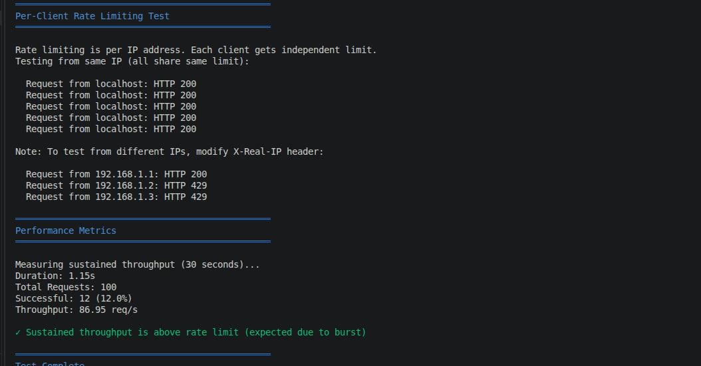

ПАРА 4:

В инструкции использовался пользователь demo, но в контейнере доступен пользователь postgres. Подключение было выполнено через: "psql -U postgres -d demo".
Отсутствие данных на начальном этапе: Логи не появлялись до момента генерации трафика. Проблема решена запуском тестовых сценариев (test-api.sh, test-rate-limiting.sh).

Анализ логов через SQL:
Просмотр записей: SELECT * FROM request_logs LIMIT 5;
Результат показал, что в логах фиксируются: метод запроса, путь, HTTP-статус, время ответа, IP клиента, признак rate limiting. 
Сводная статистика: SELECT status_code, COUNT(*) FROM request_logs GROUP BY status_code;
Получены следующие значения: 200 — 256 запросов, 429 — 335 запросов, 404 — 1 запрос
Последние события: SELECT * FROM request_logs 
ORDER BY timestamp DESC 
LIMIT 20;
По временной выборке видно, что при интенсивной нагрузке появляется серия ответов с кодом 429, что говорит о правильной работе.

Выводы:
Логирование функционирует стабильно и охватывает все типы ответов
Данные сохраняются как в файлы, так и в базу данных
Механизм rate limiting работает корректно и фиксируется в логах
Время отклика остаётся низким (в пределах нескольких миллисекунд), что указывает на отсутствие заметных задержек

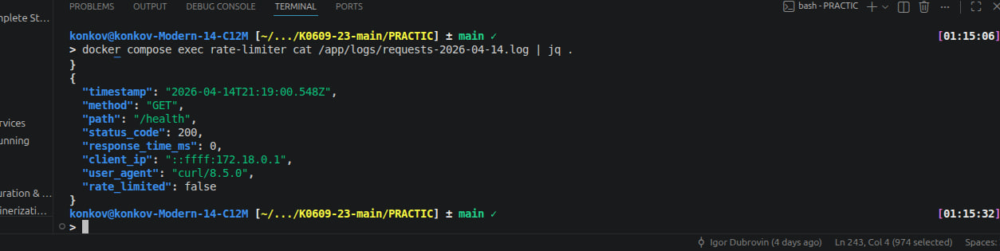

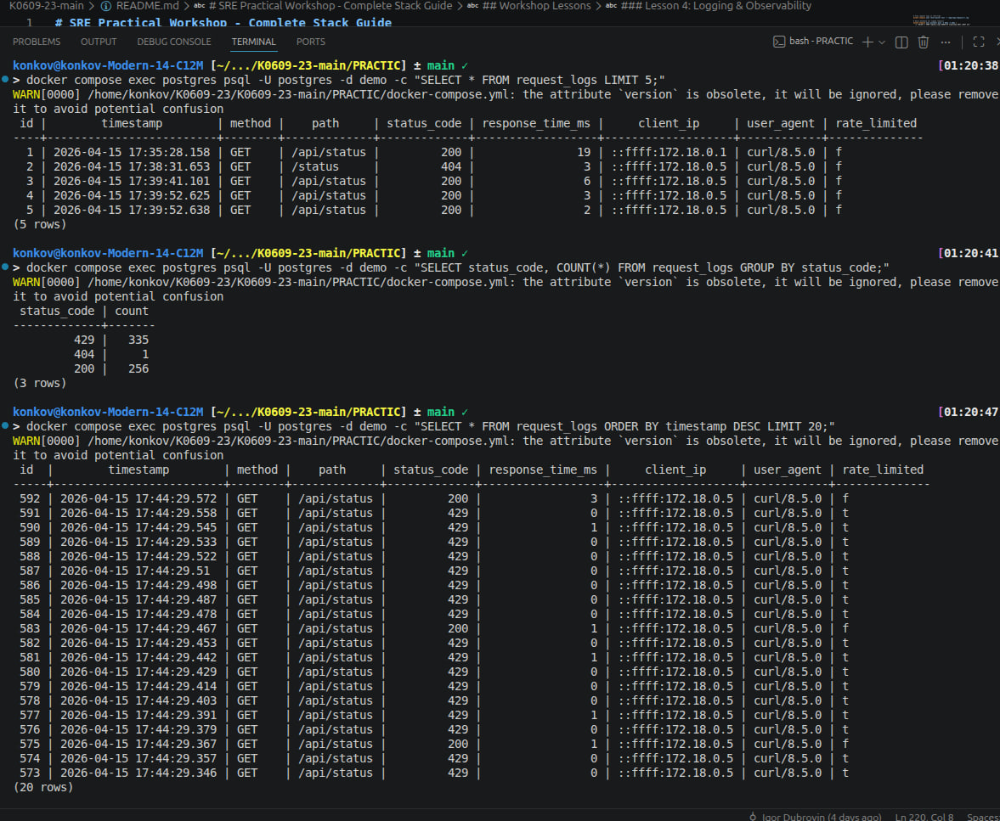

ПАРА 5:

В этом задании я разбирался с сетевой отладкой и тем, как сервисы общаются между собой в Docker.
Сначала столкнулся с проблемой: скрипт setup-debugging.sh не видел запущенные контейнеры. Поменял "docker-compose" на "docker compose" везде, и всё заработало.
Дальше с помощью tcpdump посмотрел сетевой трафик. Увидел, как контейнер rate-limiter общается с postgres (порт 5432), плюс были ARP-запросы — это значит, что сеть внутри Docker работает как надо.
Потом через curl -v проверил API — пришёл нормальный ответ 200 OK с JSON. Через strace посмотрел, какие системные вызовы происходят, чтобы понять, как именно проходит запрос.
Ещё сделал простой сценарий отказа: остановил контейнер app и попробовал сделать запрос. В ответ получил ошибку — значит система нормально реагирует на то, что backend недоступен.
В итоге: всё работает, трафик между сервисами есть, инструменты отладки отработали, и поведение при сбое тоже проверил.

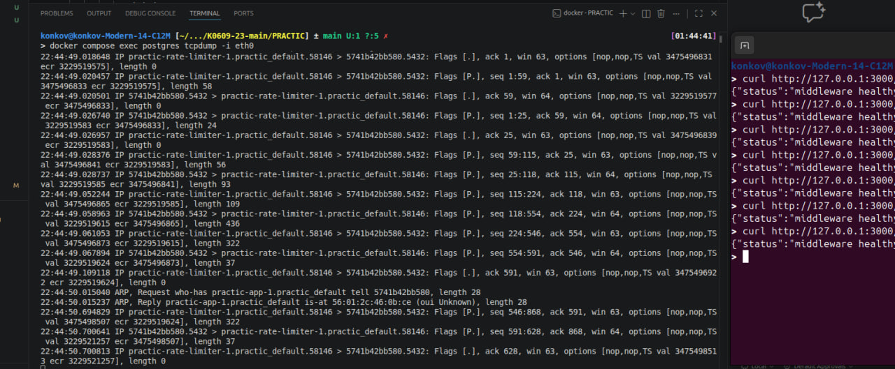

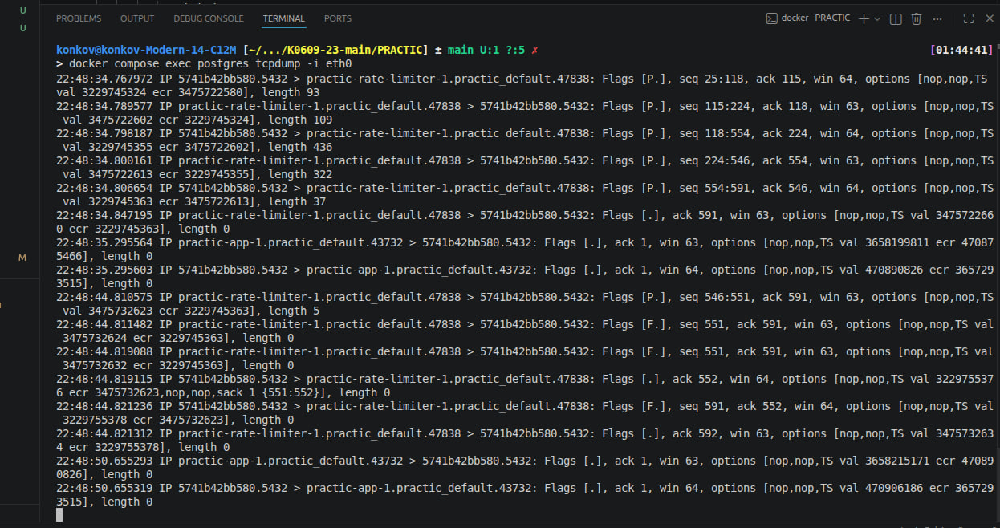

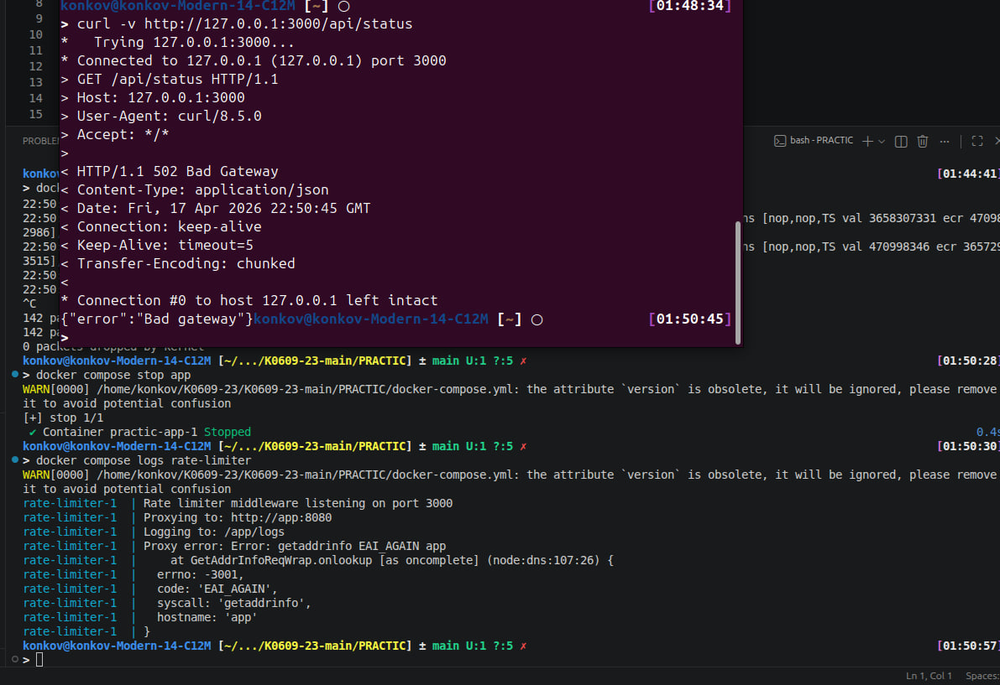