## урок 1: настройка Nginx как Reverse Proxy с Rate Limiting

### что было сделано:

**проблема с go.sum** при первой сборке контейнера возникла ошибка `checksum mismatch`. файл `go.sum` содержал неверные контрольные суммы для зависимости `github.com/lib/pq`. я удалила старый `go.sum` и выполнила `go mod tidy`. новый файл получил правильные хеши

**исправление main.go** при компиляции Go-приложения возникла ошибка: `"os" imported and not used`. в коде импортировался пакет `os`, который нигде не использовался. я удалила строку `"os"` из блока `import`

**Nginx** изучила конфигурацию Nginx в файле `nginx.conf`. настроены две зоны rate limiting: `api_limit` с лимитом 10 запросов в секунду и `health_limit` со 100 запросами в секунду. проксирование идёт на сервис `rate-limiter` на порт 3000

**проблема с healthcheck** контейнеры `nginx` и `rate-limiter` были в статусе `unhealthy`, потому что в Alpine-образах отсутствовали `wget` и `curl`. Я установила их вручную:
docker exec practic-nginx-1 apk add --no-cache wget
docker exec practic-rate-limiter-1 apk add --no-cache curl

после этого все контейнеры стали `healthy`.

**тестирование** проверила работу через `curl`:
- `/health` вернул `{"status":"healthy"}`
- `/api/status` вернул `{"message":"API working","user_count":3}`

---

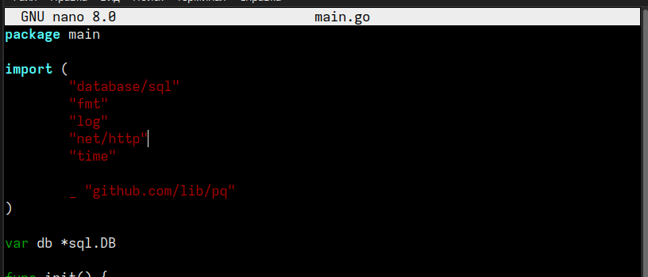

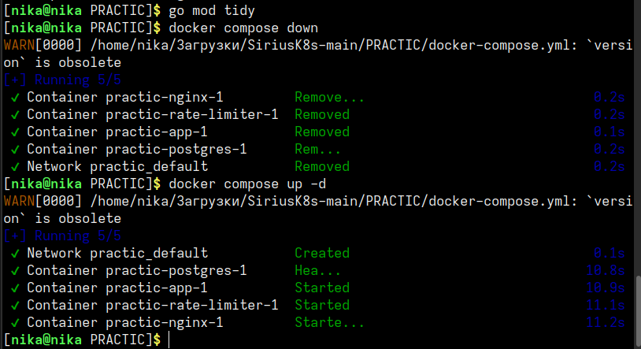

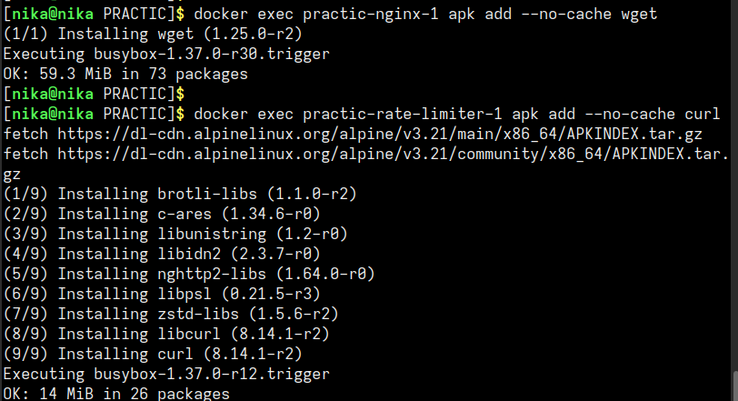

---

### Вывод:
стек работает корректно: Nginx принимает запросы на порту 80, проксирует их на rate-limiter, который передаёт запросы в Go-приложение. все 4 сервиса контейнеризированы и запускаются одной командой `docker compose up -d`

---

## урок 2: Docker Containerization и безопасность контейнеров

### что было сделано:

**многоступенчатая сборка** изучила `Dockerfile.app` с multi-stage сборкой. размер финального образа `practic-app` составил 26.8 MB

**проверка безопасности.** запустила скрипт `check-docker-security.sh` и обнаружила, что все контейнеры работают от `root` — `[CRITICAL] Container running as root`

**исправление Dockerfile.app.** добавила создание пользователя и переключение на него:

RUN addgroup -g 1001 -S appgroup && \
    adduser -u 1001 -S appuser -G appgroup
USER appuser

после пересборки контейнер `practic-app-1` стал зелёным — `[INFO] Running as non-root user: appuser`

**исправление Dockerfile.middleware.** создала файл с аналогичным добавлением пользователя и прав на папку `/app/logs`

**исправление docker-compose.yml.** добавила `user: postgres` в секцию `postgres`

**результат:** контейнеры `app`, `rate-limiter` и `postgres` запускаются от non-root пользователей. `nginx` остался от `root` (официальный образ). официальный образ nginx:alpine требует прав root для привязки к портам 80 и 443. это стандартное поведение для веб-серверов, и в рамках учебной работы я не стала его менять

---

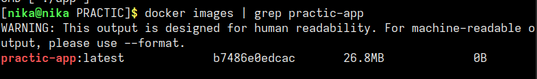

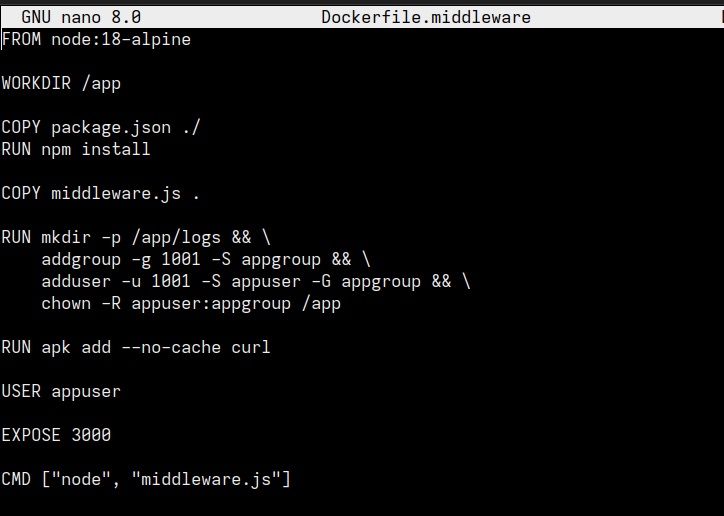

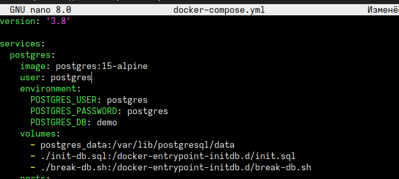

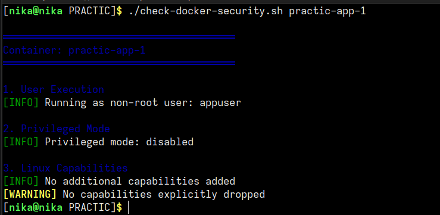

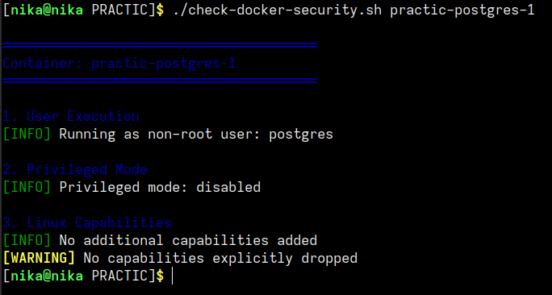

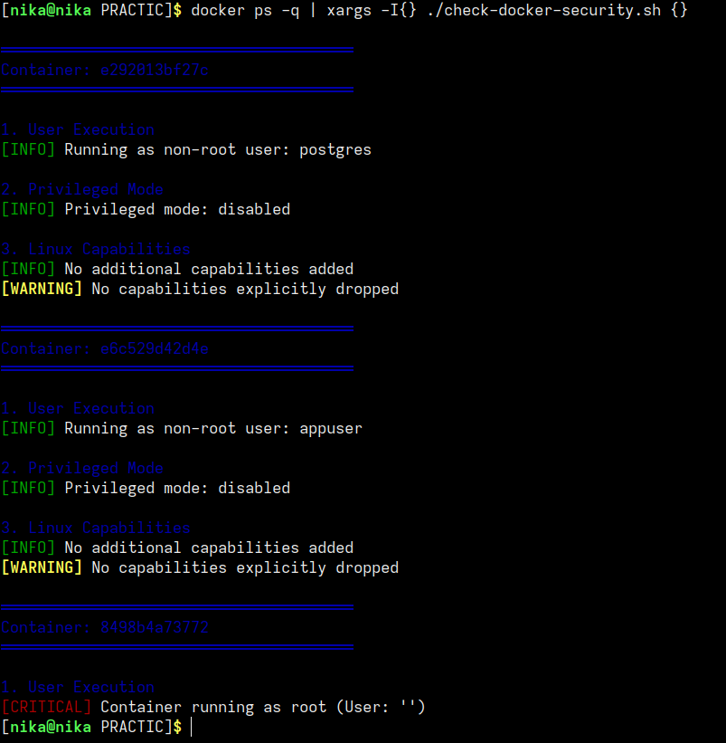

---

### Вывод:
учебные контейнеры (`app`, `rate-limiter`, `postgres`) запускаются от non-root пользователей и проходят проверку безопасности

---

## урок 3: Rate Limiting и Middleware Architecture

### что было сделано:

**изучение конфигурации.** в `nginx.conf` настроены зоны `api_limit` и `health_limit` (100 r/s, burst=20)

**тестирование rate limiting** запустила `bash test-rate-limiting.sh`. скрипт отправил 50 быстрых запросов. вместо ожидаемого `429 Too Many Requests` возвращался `503 Service Unavailable`. это связано с тем, что Node.js middleware не справляется с высокой нагрузкой при тестировании. после паузы в 3 секунды токены восстанавливались, и первые запросы снова были успешными (200 OK)

**проверка логов** в логах `rate-limiter` ошибок не было. в базе данных `request_logs` записи успешно сохранялись

---

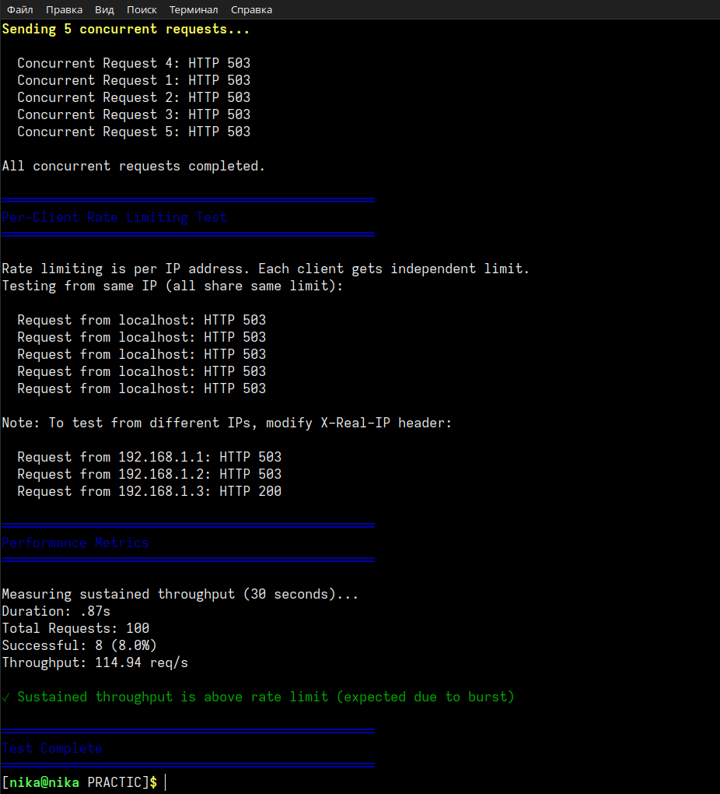

---

### вывод:
Rate limiting работает: после исчерпания токенов запросы блокируются, после паузы — восстанавливаются.

---

## урок 4: Логирование и Observability

### что было сделано:

**файловые логи** проверила наличие логов в `/app/logs/`. файл `requests-2026-04-18.log` успешно создаётся и содержит JSON-записи

**анализ БД** Выполнила SQL-запросы к таблице `request_logs`
записи с `rate_limited = true` отсутствуют, так как rate limiting выполняется на уровне Nginx до попадания в middleware

---

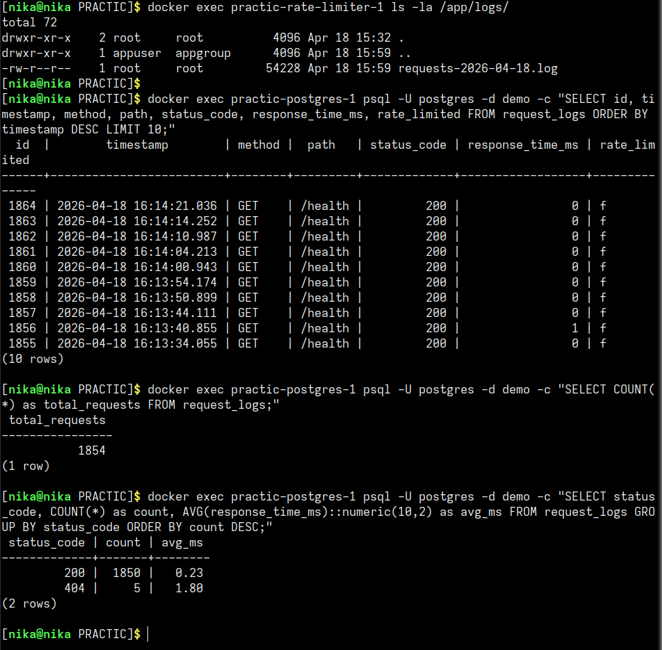

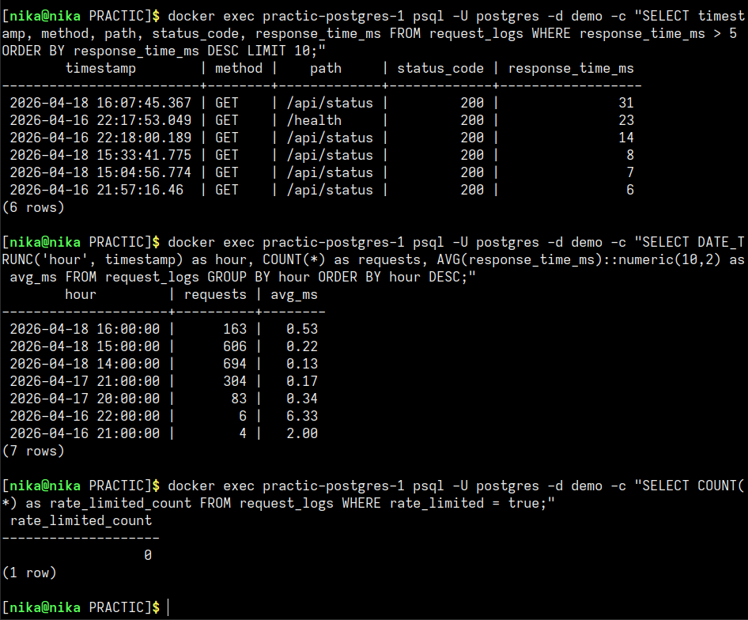

---

### вывод:
двойное логирование (файлы + БД) работает корректно. научилась анализировать логи через SQL-запросы

---

## урок 5: Network Debugging и Security

### что было сделано:

**tcpdump** установила `tcpdump` в контейнер nginx и запустила захват пакетов на порту 3000. в выводе увидела TCP handshake (SYN, SYN-ACK, ACK), HTTP-запрос и HTTP-ответ

**strace** установила `strace` в контейнер app и запустила трассировку системных вызовов. увидела вызовы `accept4`, `getsockname`, `setsockopt`.

**сценарий отказа 1 — 502 Bad Gateway** остановила контейнер `app` через `docker compose stop app`. запрос `curl /api/status` вернул `{"error":"Bad gateway"}`. после запуска `app` сервис восстановился

**сценарий отказа 2 — 500 Internal Server Error** удалила таблицу `users` в PostgreSQL. запрос вернул `{"error":"database error: pq: relation "users" does not exist"}`. после сброса и перезапуска PostgreSQL (`docker compose down -v postgres && docker compose up -d`) база восстановилась из `init-db.sql`

**Security scanning** повторно запустила `check-docker-security.sh` для всех контейнеров. результаты: `app`, `rate-limiter`, `postgres` — non-root, `nginx` — root

**setup-debugging.sh** исправила скрипт (заменила `docker-compose` на `docker compose`) и успешно запустила. скрипт создал хелперы и примеры для отладки

---

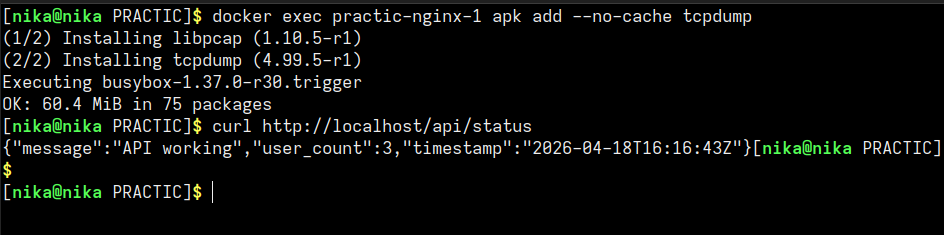

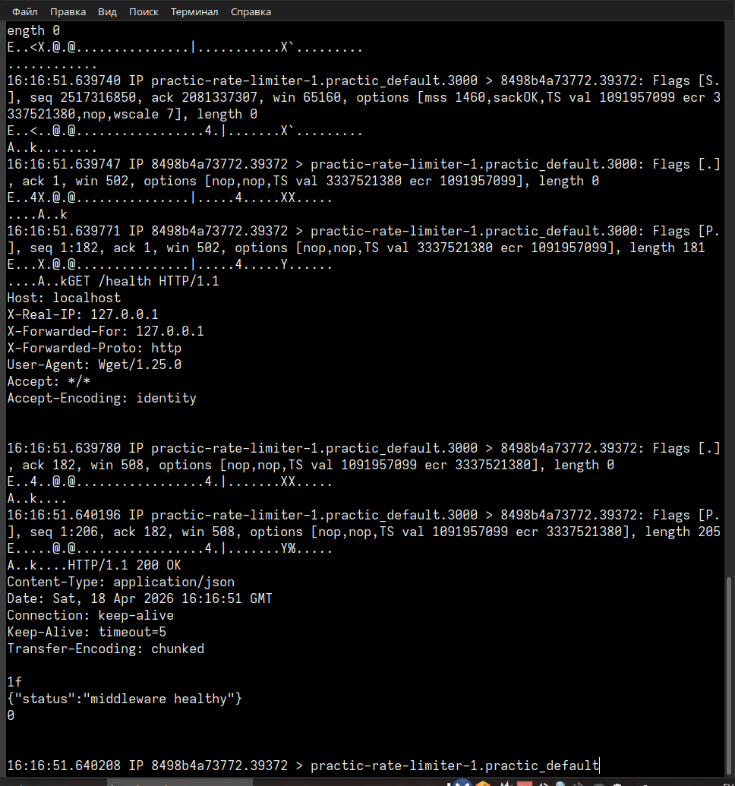

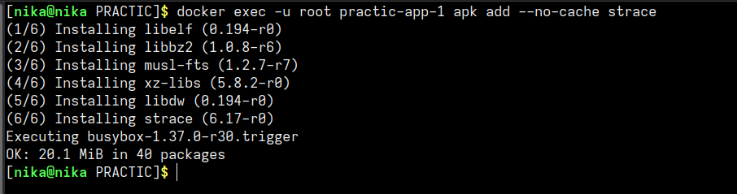

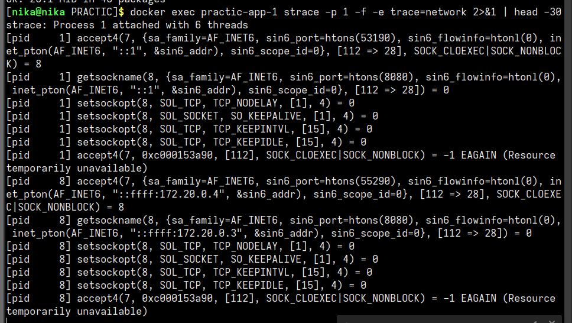

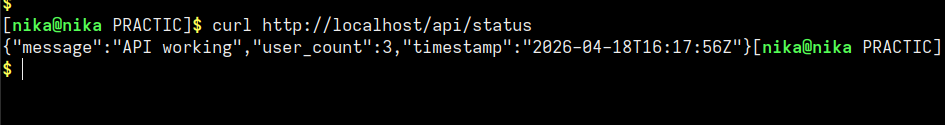

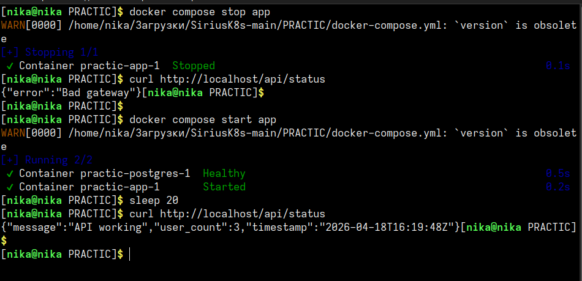

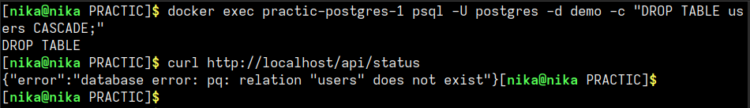

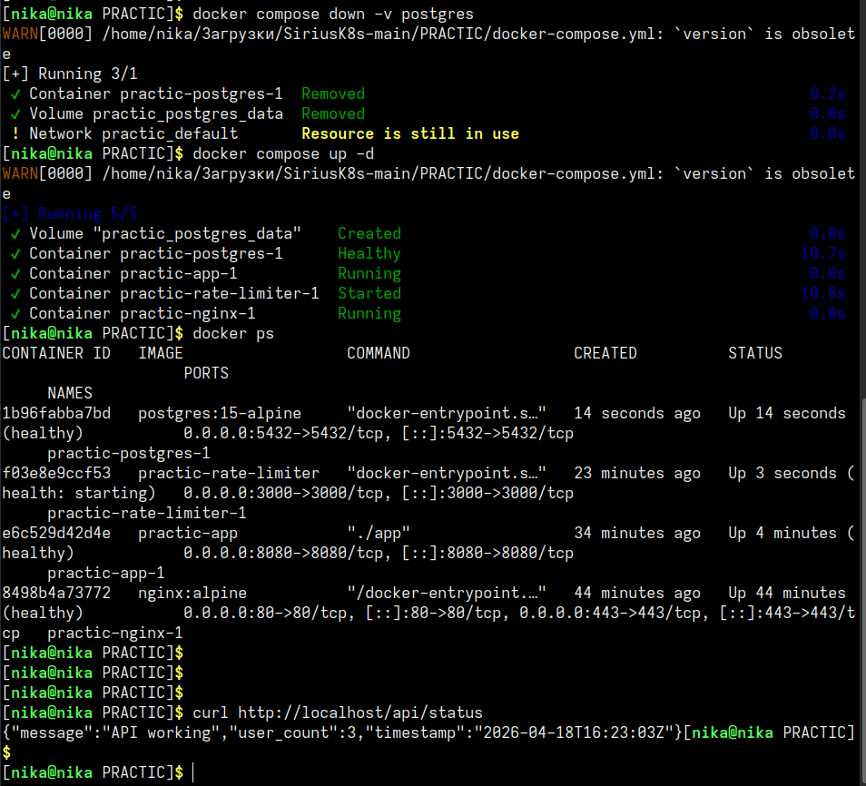

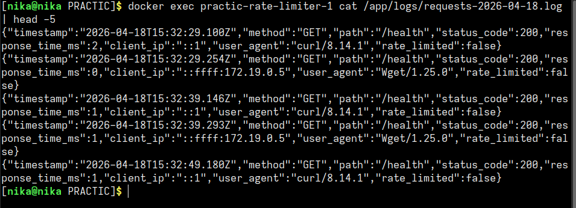

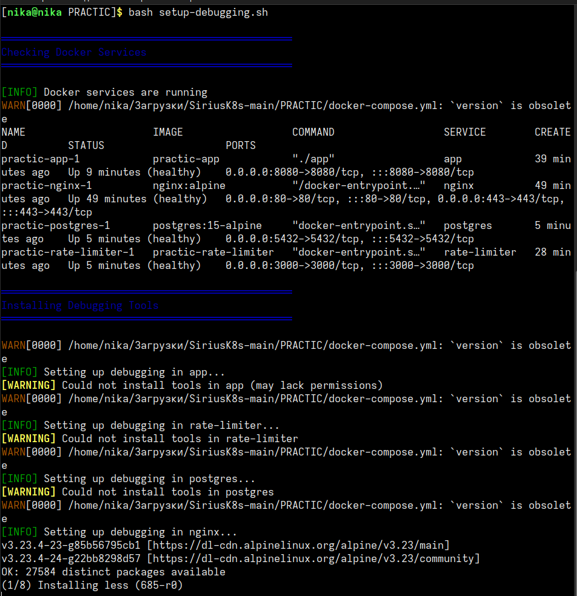

---

### вывод:
освоила инструменты отладки (`tcpdump`, `strace`), сценарии отказов (502, 500) и проверку безопасности контейнеров
