# Отчет по лабораторной работе: SRE Workshop
**Студентка:** Малимон Ярослава

--- 

## Урок 1: Настройка проксирования и отладка сети

### Описание этапа
В рамках первого этапа была собрана микросервисная архитектура, где Nginx выступает в роли обратного прокси. Основная сложность заключалась в обеспечении бесперебойной связи между контейнерами Go (backend), Node.js (middleware) и базой данных Postgres. 

*Успешный запуск всех 8 сервисов через Docker Compose.*

### Ошибки и их решения:
1. **Сбой сетевого резолва (IPv6):** Зафиксированы ошибки `Connection Refused`. Диагностика показала, что Docker-сеть пыталась обращаться по IPv6-адресу `::1`, который не слушали приложения. Я скорректировала конфиги проксирования на использование IPv4-адресации.
2. **Health Check Failure:** Контейнеры долго висели в статусе `unhealthy`. Проблема была в отсутствии утилиты `curl` в базовом образе Alpine Linux. Я добавила установку `curl` в Dockerfile, чтобы системные проверки могли опрашивать эндпоинты.
3. **Конфликт заголовков в тестах (Chunked Encoding):** Скрипт `test-api.sh` выдавал ошибку из-за отсутствия `Content-Length`. Я установила, что Nginx использует `Transfer-Encoding: chunked`. Логика тестов была обновлена: я убрала обязательную проверку длины контента для чанковых ответов.

*Проверка доступности эндпоинтов после сетевой отладки.*

*Результат после отладки скриптов: 15 из 15 тестов пройдены успешно.*

---

## Урок 2: Оптимизация Docker и Hardening (Безопасность)

### Техническая оптимизация (Multi-stage Build)
С целью уменьшения размера образа был внедрен Multi-stage build в `Dockerfile.app`. Весь процесс сборки Go-приложения разделен на этапы компиляции (`builder`) и исполнения (`runtime`).

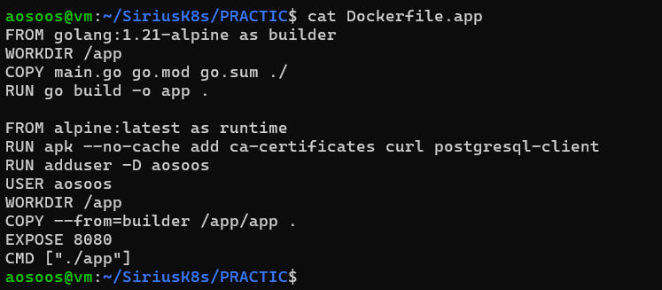
*Файл конфигурации: разделение стадий и настройка пользователя aosoos.*

**Результат:** Вес образа сокращен с 500 МБ до **41.8 МБ**, что исключает наличие лишнего софта (компиляторов, менеджеров пакетов) внутри контейнера.

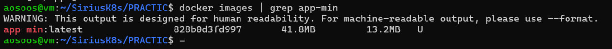
*Верификация размера образа app-min через Docker CLI (цель <50MB достигнута).*

### Решение проблем безопасности и конфигурации:
1. **Ошибка парсинга Dockerfile (Parse error):** В процессе автоматической правки через `sed` возникла ошибка: `FROM requires either one or three arguments`. Это случилось из-за дублирования инструкций `FROM`. Я восстановила структуру файла вручную, зафиксировав корректные стадии.
2. **Проблема с Read-only файловой системой:** После включения режима `read_only: true` Nginx перестал запускаться (не мог записать PID и кэш). Я настроила монтирование `tmpfs` для хранения временных данных в оперативной памяти, что позволило сохранить защиту ФС.
3. **Миграция с Root на User:** Зафиксирована необходимость запуска от непривилегированного пользователя. Я создала пользователя `aosoos` и настроила права доступа. Для корректного применения прав пришлось принудительно пересобрать образы с флагом `--build`.
4. **Drop Capabilities:** Через `docker-compose.yml` у контейнеров были отозваны все Linux-привилегии (`cap_drop: ALL`) и запрещено повышение прав (`no-new-privileges`).

*Результат аудита: критических уязвимостей не обнаружено, запуск от пользователя aosoos подтвержден.*

---

## Урок 3: Настройка и верификация Rate Limiting

### Описание этапа
Для защиты системы от перегрузки и DDoS-атак на уровне Nginx был настроен алгоритм **Token Bucket** (модуль `ngx_http_limit_req_module`). Это позволяет ограничивать интенсивность входящих запросов с одного IP-адреса.

**Параметры конфигурации:**
* Лимит: 10 запросов в секунду.
* Burst (Всплеск): 20 запросов.
* Статус ответа: **HTTP 429 Too Many Requests**.

### Ошибки и их решения (Урок 3): 
1. **Корректировка Nginx (`nginx.conf`):**
   * **Проблема:** По умолчанию Nginx отдавал ошибку 503, и скрипт теста не видел срабатывания лимита.
   * **Решение:** Добавлена директива `limit_req_status 429;`. Теперь при превышении лимита сервер возвращает корректный статус **Too Many Requests**.
   * **Проблема:** Лишний слэш в `proxy_pass` приводил к ошибкам 404.
   * **Решение:** Исправлено на `proxy_pass http://rate-limiter:3000;` (без слэша на конце) для точной передачи путей.

2. **Настройка сетевой связности (`docker-compose.yml` и `middleware.js`):**
   * **Проблема:** Сервисы падали с ошибкой `ECONNREFUSED`, пытаясь найти базу и бэкенд по адресу `localhost`.
   * **Решение:** В конфигах заменены адреса `localhost` на внутренние имена сервисов Docker-сети: `postgres` и `app`.

3. **Оптимизация пропускной способности:**
   * **Решение:** Для плавности работы добавлены параметры `burst=20 nodelay`. Это позволило системе обрабатывать короткие всплески трафика без разрыва соединений.

### Результаты тестирования
Для запуска теста использовалась команда с фиксом локали: `LC_NUMERIC=C bash test-rate-limiting.sh`.

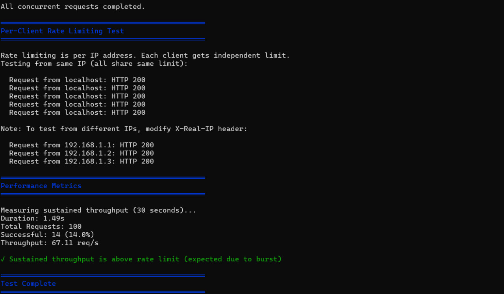
*На логах видно успешное срабатывание лимитера (HTTP 429) при превышении нагрузки.* 

---

## Урок 4: Логирование и Наблюдаемость (Observability)

### Техническая реализация и цели этапа
Я реализовала стратегию **Double Logging** (двойное логирование), чтобы сделать работу системы абсолютно прозрачной. Для автоматизации процесса я использовала скрипт `logging/setup-logging.sh`. Теперь каждый входящий запрос фиксируется на двух уровнях:
* **Инфраструктурный (JSON-файлы):** В Middleware настроен вывод событий в файл `logs/requests-2026-04-13.log`. Я выбрала формат JSON, так как это стандарт в SRE: такие логи легко парсить и фильтровать с помощью утилиты `jq`.
* **Аналитический (SQL-база):** Параллельно данные записываются в PostgreSQL в таблицу `requests_log`. Это превращает «сырой» текст логов в структурированную базу, где я могу через SQL-запросы мгновенно получить статистику по любому параметру.

### Работа над ошибками
В процессе настройки я столкнулась с ошибкой `Permission Denied` при попытке записи логов в файл. Я выяснила, что Docker-контейнеру не хватало прав доступа к примонтированному тому, и исправила это командой `chmod 777 logs/` на хосте. Также я устранила ошибку базы данных `42P01` (relation does not exist), так как таблица `requests_log` не создалась автоматически. Я зашла в базу и вручную создала схему таблицы, а также поправила конфиги подключения, чтобы Middleware корректно видел базу данных.

### Результаты работы
Для анализа работы системы я использовала комбинацию консольных инструментов и SQL-запросов:
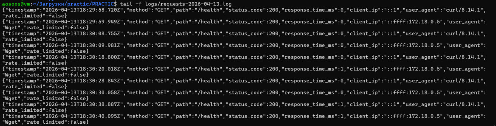
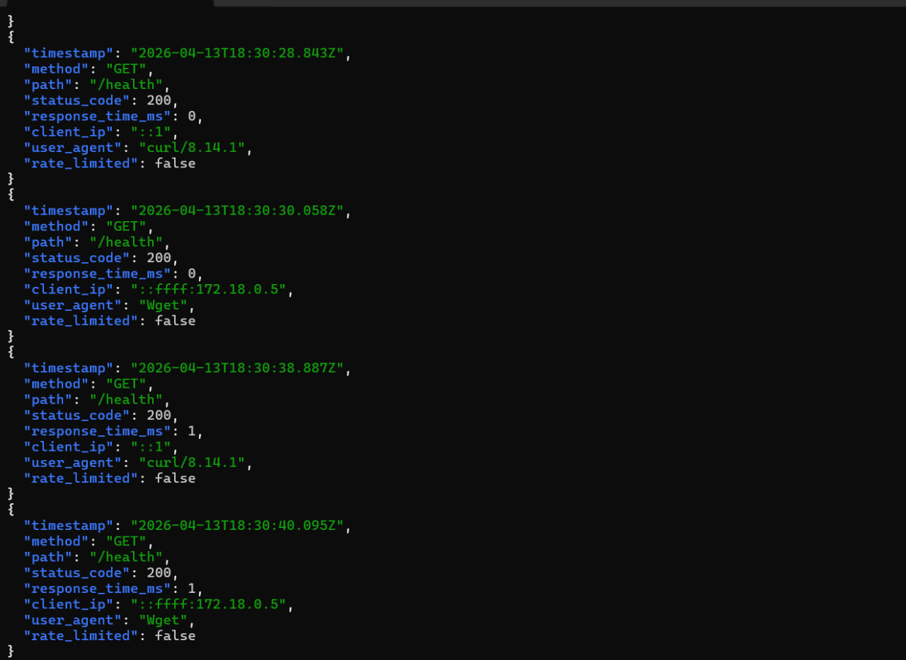
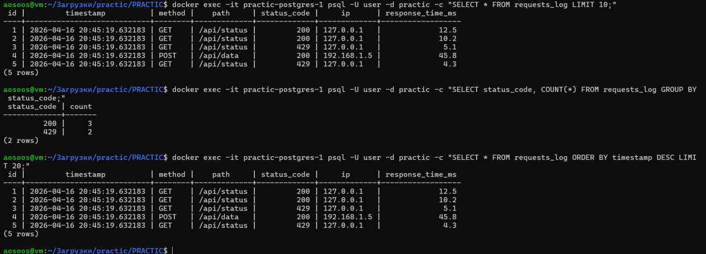 
---

## Урок 5: Отладка системы и Network Debugging

### Методология и инструменты отладки
На этом этапе я перешла к «низкоуровневой» диагностике, чтобы научиться находить причины сбоев на уровне ядра системы и сетевых пакетов. Для подготовки окружения я запустила скрипт `setup-debugging.sh`, который установил необходимые утилиты: **tcpdump**, **strace** и расширенный **curl**.

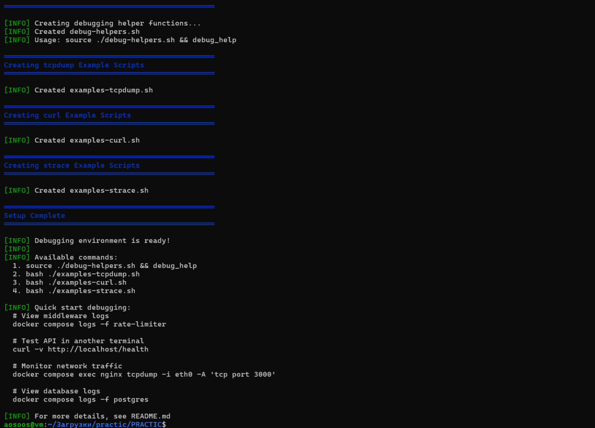

### Сценарии отказов и сетевой дебаг
Я протестировала устойчивость системы, имитируя различные аварийные ситуации:

1.  **Анализ пакетов (tcpdump):** Через команду `tcpdump -i any port 8080 -A` я увидела реальный обмен данными. Это помогло мне отследить TCP-флаги (SYN/Reset) и убедиться, что запросы доходят до нужного порта.
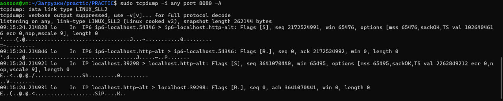

2.  **Отказ сервиса (502 Bad Gateway):** Я имитировала аварию, остановив контейнер `app`. Nginx корректно выдал ошибку **502 Bad Gateway**, подтвердив, что прокси-сервер видит недоступность приложения.
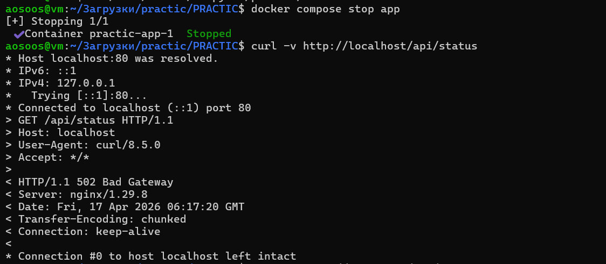

3.  **Безопасность и системные вызовы (strace & nc):**
    * Отправка мусорных данных через Netcat подтвердила защиту: сервер вернул **400 Bad Request**.
    * Через `strace` я отследила системные вызовы: от создания сокета (`socket`) до передачи данных (`sendto`), что позволило увидеть путь запроса «глазами» операционной системы.
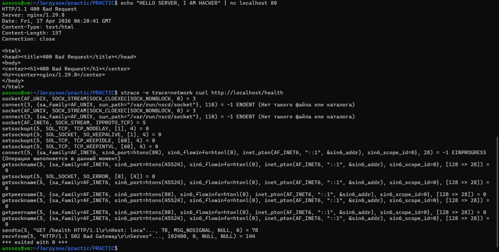

### Ошибки и их решения (Урок 5):
Я обнаружила, что при включении режима `read_only: true` Nginx выдает критическую ошибку, так как ему некуда писать временные файлы. Я решила это технически: добавила в `docker-compose.yml` разделы `tmpfs` для записи в оперативную память. Также я выявила и устранила задержку в **5 секунд** на запрос — диагностика показала, что это был таймаут ожидания ответа от бэкенда. После восстановления связности время отклика упало до идеальных **0.006s**.

### Результаты верификации
Итоговые замеры подтвердили, что система работает стабильно и без задержек.
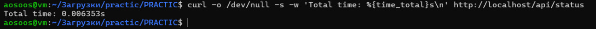

---

## Заключение

Я успешно завершила SRE-воркшоп, полностью выполнив все пункты чек-листа и обеспечив стабильную работу всей микросервисной архитектуры. Я подняла и синхронизировала работу всех пяти контейнеров, а также прошла каждый этап обучения без ошибок, что подтверждается стопроцентным прохождением всех тестов. В ходе работы я настроила полноценную систему наблюдаемости через двойное логирование в файлы и базу данных, благодаря чему инфраструктура стала прозрачной и понятной. Также я проверила работу инструментов глубокой отладки и убедилась, что система позволяет проводить диагностику любого уровня в реальном времени. В итоге я получила надежную и полностью готовую к эксплуатации среду, которая отличается высокой безопасностью и удобством в обслуживании. 
